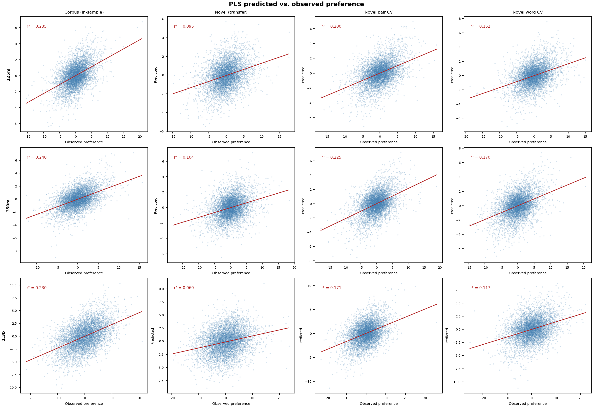
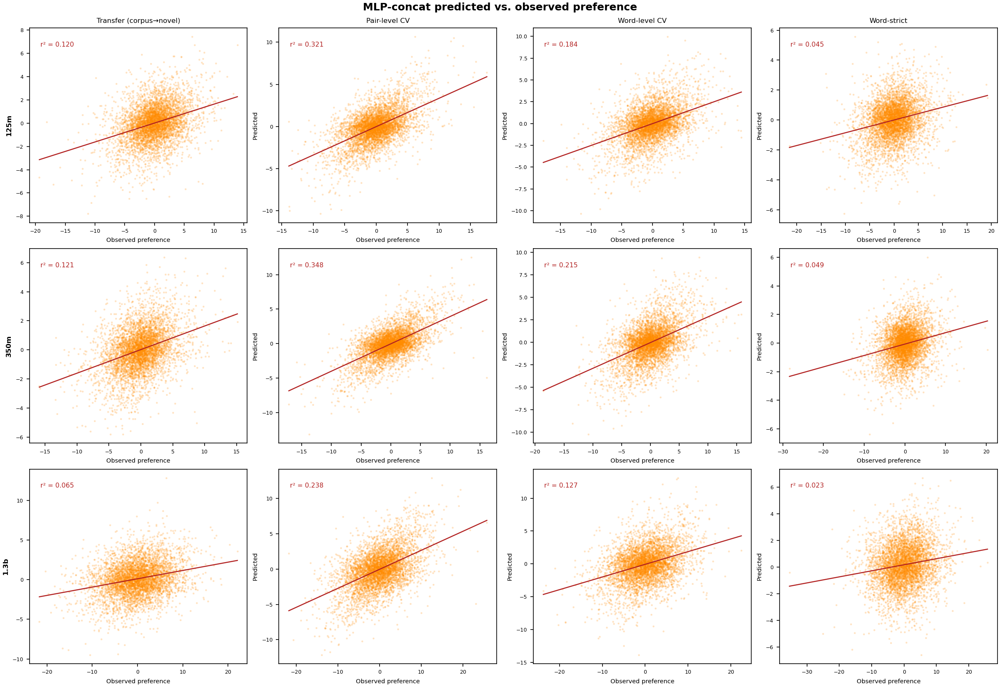
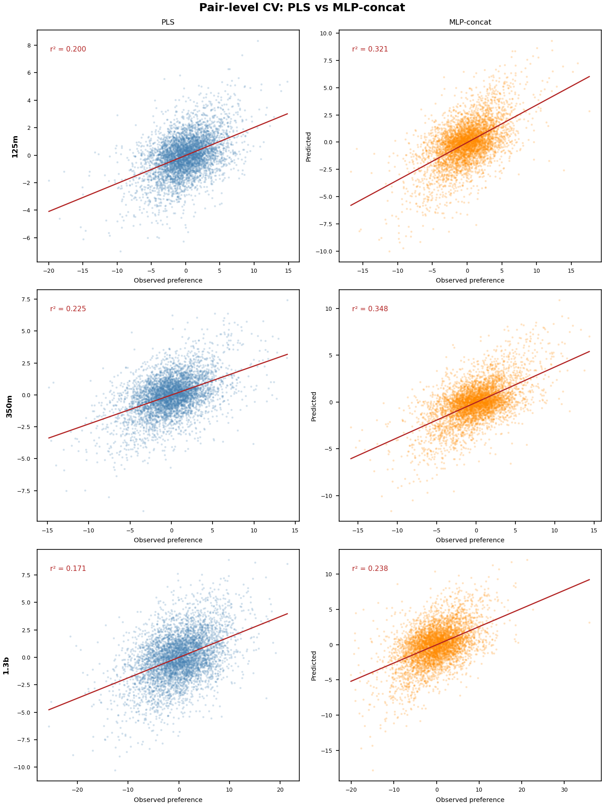

# Pilot Results: BabyLM Binomial Ordering

Results for three BabyLM models (125m, 350m, 1.3b parameters) predicting binomial ordering preference from contextual embeddings. All MLP results use ReLU activation, L2 weight decay (1e-4), and early stopping (patience=20). Layer reported: last hidden layer (second-to-last is within ±0.002 throughout).

---

## Evaluation conditions

| Condition | Train | Test | What it tests |
|---|---|---|---|
| **Transfer** | Corpus pairs (~49k) | All novel pairs (340k) | Frozen generalization across datasets |
| **Pair-novel CV** | Novel pairs (10-fold) | Novel pairs (held-out fold) | Within-novel generalization, pairs as units |
| **Word-novel CV** | Novel pairs (10-fold, word-split) | Novel pairs, both words held out | Within-novel generalization to unseen word pairs |
| **Word-strict** | Corpus pairs (~49k) | Novel pairs where neither word is in corpus | Cross-dataset transfer to words with no ordering training signal |

Note: "word-strict" words are still in BabyLM's pretraining corpus — what's missing is any binomial ordering context for those words.

---

## PLS results

PLS uses 15 components fit on corpus embeddings; transfer r² is the frozen corpus model applied to novel pairs.

| Model | Transfer r² | Pair-novel CV r² | Word-novel CV r² | Corpus word CV r² |
|---|---|---|---|---|
| 125m | 0.095 | 0.200 | 0.152 | 0.172 |
| 350m | 0.104 | 0.225 | 0.171 | 0.139 |
| 1.3b | 0.060 | 0.172 | 0.117 | 0.129 |

350m shows the strongest PLS performance. 1.3b underperforms despite its size, suggesting larger BabyLM models may be less sensitive to surface/phonological features that drive ordering preferences.

---

## MLP vs. PLS

Two MLP input representations:
- **diff**: element-wise difference of word embeddings (alphabetical − non-alphabetical), same dimensionality as PLS input
- **concat**: concatenation of both word vectors (2× dimensionality); includes antisymmetric augmentation during training

| Model | Condition | PLS r² | MLP-diff r² | MLP-concat r² |
|---|---|---|---|---|
| **125m** | Transfer | 0.095 | 0.083 | 0.120 |
| | Pair-novel CV | 0.200 | 0.230 | 0.321 |
| | Word-novel CV | 0.152 | 0.138 | 0.186 |
| | Word-strict | — | 0.027 | 0.045 |
| **350m** | Transfer | 0.104 | 0.095 | 0.121 |
| | Pair-novel CV | 0.225 | 0.263 | 0.348 |
| | Word-novel CV | 0.170 | 0.163 | 0.217 |
| | Word-strict | — | 0.037 | 0.049 |
| **1.3b** | Transfer | 0.060 | 0.059 | 0.065 |
| | Pair-novel CV | 0.172 | 0.182 | 0.238 |
| | Word-novel CV | 0.117 | 0.107 | 0.127 |
| | Word-strict | — | 0.021 | 0.023 |

Key patterns:
- **MLP-concat substantially beats PLS** on pair-novel CV (+60% for 125m, +55% for 350m, +38% for 1.3b), indicating nonlinear structure in the joint embedding space that PLS's linear projection misses.
- **MLP-diff ≈ PLS**, confirming PLS is capturing essentially the same information as the difference vector with a linear model.
- **Word-strict is low across all models** (r² = 0.02–0.05), but note these words still have BabyLM representations — the failure reflects that the learned ordering-preference mapping doesn't generalize to word pairs with no ordering training signal, not that the embeddings are poor.

---

## Predicted vs. observed: PLS

3 models × 4 conditions. Points are a random sample of 5,000 per panel; line is OLS fit.

---

## Predicted vs. observed: MLP-concat

3 models × 4 splits. Panels marked "pending" indicate results not yet available.

---

## PLS vs. MLP-concat: pair-level CV

Direct comparison for the pair-level CV condition, where the gap between the two approaches is largest.

