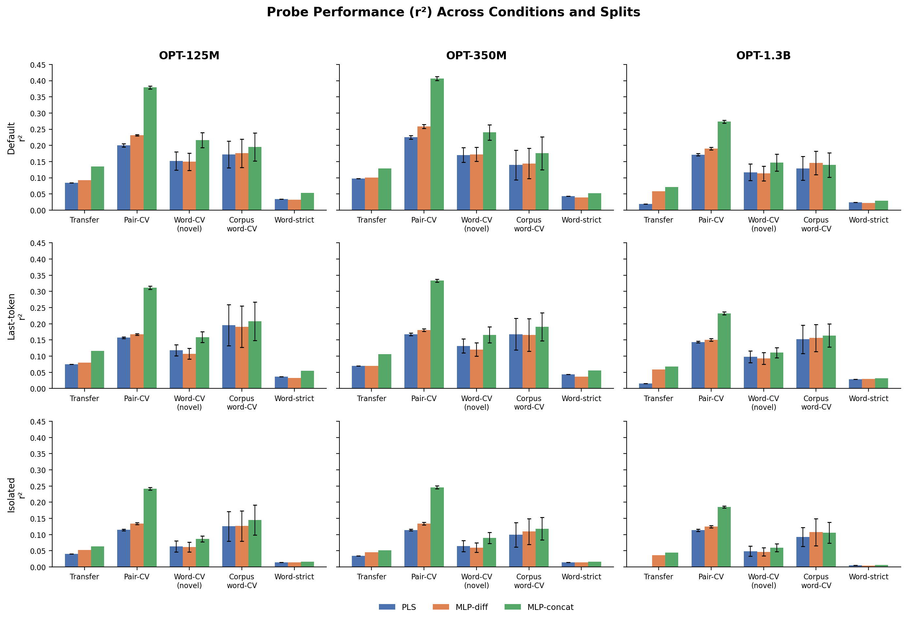
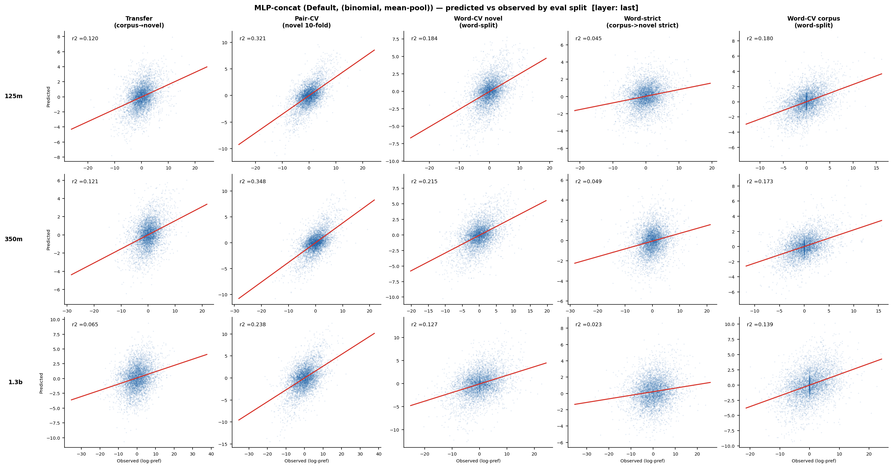
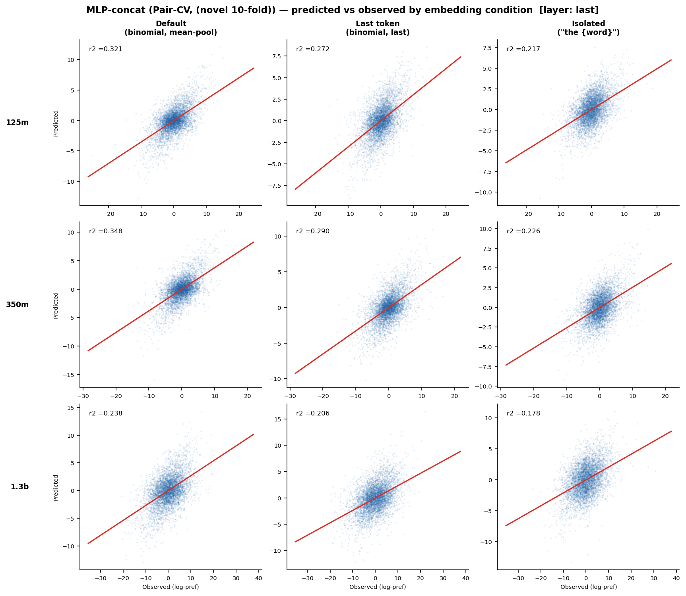
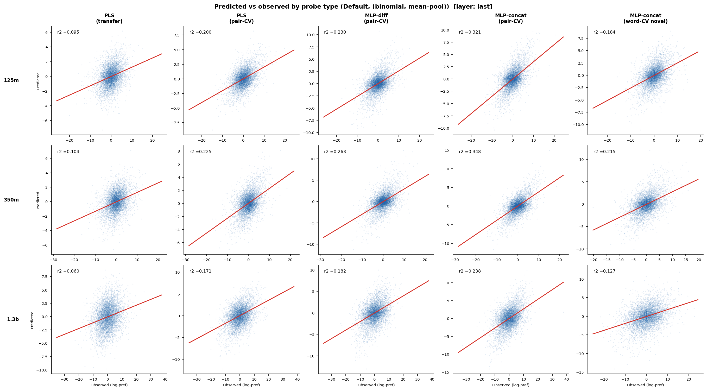

# Pilot Results: BabyLM Binomial Ordering

We probe three BabyLM causal language models (125m, 350m, and 1.3b parameters) to assess whether their contextual embeddings encode binomial ordering preferences. For each noun pair (e.g., *bread* and *butter*), the target is the log-preference score log P(*bread and butter*) − log P(*butter and bread*), derived from the model's own token probabilities in a binomial context sentence. Three probe types and three embedding conditions are crossed and evaluated across five generalization splits. All embeddings come from the last hidden layer (second-to-last is within ±0.002 throughout).

---

## Probes

Three probes were fit to predict ordering preference from pairs of word embeddings.

**PLS (Partial Least Squares).** For each pair, the input is the difference vector `vec_alpha − vec_non_alpha`, where `vec_alpha` is the embedding extracted from the alpha-order sentence (e.g., "bread and butter") and `vec_non_alpha` from the reverse. PLS finds 15 latent components (NIPALS algorithm) that maximize covariance between this difference vector and the scalar preference score, then regresses preference on those components. Because the input is already the antisymmetric difference, PLS is effectively a linear model on the contrast between the two orderings.

**MLP-diff.** Takes the same difference vector as PLS, but applies a nonlinear two-layer network: Linear(dim, 15) → ReLU → Linear(15, 1), with L2 weight decay (1e-4) and early stopping (patience = 20). Comparing MLP-diff to PLS isolates the contribution of nonlinearity while holding the input representation constant.

**MLP-concat.** Takes the full concatenation of both vectors, `[vec_alpha; vec_non_alpha]`, as input (2× dimensionality). Trained with antisymmetric augmentation: for each pair (A, B) with preference p, the reversed pair (B, A) with preference −p is added to the training set, enforcing that the learned function satisfies f(A, B) = −f(B, A). Comparing MLP-concat to MLP-diff tests whether access to the full joint representation, rather than just the difference, carries additional ordering signal beyond what a linear contrast captures.

---

## Embedding conditions

Three conditions vary how word embeddings are extracted from the model for each binomial pair.

| Condition | Context | Extraction | What it captures |
|---|---|---|---|
| **Default** | Binomial sentence (e.g., "dogs and cats") | Mean-pool over span tokens [w1, and, w2] | Both words represented simultaneously in binomial ordering context |
| **Last-token** | Binomial sentence | Final subtoken of each word's span | Boundary representation of each word in binomial context |
| **Isolated** | "the {word}" (each word in isolation) | Mean-pool over word tokens | Out-of-context word representation, no binomial ordering frame |

The preference DV is always derived from the binomial context regardless of condition; only the embeddings used as probe input change. For the last-token condition, `vec_alpha` is the hidden state at the final subtoken of the second word in the alpha-order sentence (e.g., "butter" in "bread and **butter**"), and `vec_non_alpha` is the final subtoken of the second word in the reverse sentence (e.g., "bread" in "butter and **bread**") — in both cases the model processes the full sentence up to and including that token. The isolated condition tests whether context-free word representations carry ordering signal without any sentence-level framing.

---

## Evaluation splits

Five splits test generalization at increasing levels of strictness.

| Split | Train | Test | Notes |
|---|---|---|---|
| **Transfer** | Corpus (~49k) | All novel (340k) | Probe frozen after corpus fit |
| **Pair-CV** | Novel (10-fold) | Novel held-out fold | Pairs as held-out units |
| **Word-CV (novel)** | Novel (10-fold, word-split) | Novel, both words unseen in train | Generalization to unseen word pairs |
| **Corpus word-CV** | Corpus (10-fold, word-split) | Corpus, both words unseen in train | Within-corpus word generalization |
| **Word-strict** | Corpus (~49k) | Novel pairs, neither word in corpus | Transfer to words with zero corpus ordering signal |

"Word-strict" words are still in BabyLM's pretraining data; what's missing is any binomial ordering context for those words during probe training.

"—" indicates the metric wasn't computed.

---

## Results

### Default (binomial sentence, span mean-pooled)

| Eval split | 125m PLS | 125m MLP-diff | 125m MLP-concat | 350m PLS | 350m MLP-diff | 350m MLP-concat | 1.3b PLS | 1.3b MLP-diff | 1.3b MLP-concat |
|---|---:|---:|---:|---:|---:|---:|---:|---:|---:|
| Transfer | 0.095 | 0.083 | 0.120 | 0.104 | 0.095 | 0.121 | 0.060 | 0.059 | 0.065 |
| Pair-CV | 0.200 | 0.230 | 0.321 | 0.225 | 0.263 | 0.348 | 0.171 | 0.182 | 0.238 |
| Word-CV (novel) | 0.152 | 0.138 | 0.186 | 0.170 | 0.163 | 0.217 | 0.117 | 0.107 | 0.127 |
| Corpus word-CV | 0.172 | 0.172 | 0.183 | 0.139 | 0.141 | 0.176 | 0.129 | 0.144 | 0.142 |
| Word-strict | 0.034 | 0.027 | 0.045 | 0.043 | 0.037 | 0.049 | 0.024 | 0.021 | 0.023 |

MLP-concat substantially outperforms PLS on pair-CV (r² 0.238–0.348 vs. 0.171–0.225), indicating nonlinear structure in the joint embedding space that a linear projection on the difference vector doesn't capture. MLP-diff tracks PLS closely throughout, confirming that PLS recovers essentially the same information as a nonlinear probe on the same difference input. Word-strict performance is low across all probes (r² 0.021–0.049), likely reflecting the idiosyncratic nature of attested corpus binomials rather than a fundamental failure of generalization: the probe learns preferences that are specific to frozen or near-frozen expressions, which do not carry over to novel pairs whose ordering is governed by more general principles. The 350m model consistently leads; 1.3b underperforms relative to its size, suggesting the larger BabyLM model may be less sensitive to the surface features driving ordering preferences.

### r² by hidden dim (h64, h128) — all conditions

Capacity ablation across h15/h64/h128 and all three embedding conditions. Default h15 reproduced from above for reference; h15 was not run for last-token or isolated. "—" = pending pipeline completion.

#### OPT-125M

| Eval split | Md h15 | Md h64 | Md h128 | Mc h15 | Mc h64 | Mc h128 | LT Md h64 | LT Md h128 | LT Mc h64 | LT Mc h128 | Iso Md h64 | Iso Md h128 | Iso Mc h64 | Iso Mc h128 |
|:--|---:|---:|---:|---:|---:|---:|---:|---:|---:|---:|---:|---:|---:|---:|
| Transfer | .083 | .087 | .092 | .120 | .126 | .135 | .080 | .080 | .114 | .116 | .053 | .053 | .064 | .064 |
| Pair-CV | .230 (.003) | .229 (.004) | .232 (.002) | .321 (.002) | .359 (.005) | .379 (.004) | .167 (.003) | .167 (.003) | .299 (.005) | .311 (.005) | .132 (.002) | .134 (.003) | .238 (.004) | .242 (.004) |
| Word-CV (novel) | .138 (.037) | .148 (.027) | .150 (.027) | .186 (.024) | .208 (.023) | .216 (.023) | .107 (.018) | .107 (.017) | .158 (.022) | .159 (.017) | .059 (.013) | .062 (.015) | .087 (.009) | .087 (.009) |
| Corpus word-CV | .172 (.047) | .172 (.040) | .176 (.044) | .183 (.047) | .199 (.043) | .196 (.043) | .192 (.066) | .191 (.064) | .204 (.057) | .208 (.060) | .131 (.049) | .127 (.047) | .141 (.039) | .145 (.046) |
| Word-strict | .027 | .029 | .032 | .045 | .048 | .053 | .033 | .033 | .052 | .054 | .014 | .014 | .015 | .016 |

#### OPT-350M

| Eval split | Md h15 | Md h64 | Md h128 | Mc h15 | Mc h64 | Mc h128 | LT Md h64 | LT Md h128 | LT Mc h64 | LT Mc h128 | Iso Md h64 | Iso Md h128 | Iso Mc h64 | Iso Mc h128 |
|:--|---:|---:|---:|---:|---:|---:|---:|---:|---:|---:|---:|---:|---:|---:|
| Transfer | .095 | .098 | .100 | .121 | .125 | .129 | .075 | .070 | .104 | .106 | .041 | .046 | .049 | .052 |
| Pair-CV | .263 (.008) | .257 (.008) | .258 (.006) | .348 (.008) | .391 (.008) | .407 (.006) | .178 (.004) | .181 (.004) | .318 (.005) | .333 (.005) | .134 (.004) | .134 (.004) | .241 (.004) | .246 (.005) |
| Word-CV (novel) | .163 (.025) | .170 (.021) | .172 (.021) | .217 (.030) | .233 (.020) | .240 (.023) | .120 (.021) | .121 (.020) | .154 (.025) | .166 (.025) | .056 (.015) | .060 (.015) | .085 (.016) | .089 (.017) |
| Corpus word-CV | .141 (.045) | .143 (.046) | .144 (.046) | .176 (.055) | .181 (.056) | .176 (.051) | .168 (.046) | .165 (.050) | .191 (.039) | .190 (.043) | .107 (.044) | .109 (.040) | .120 (.031) | .118 (.035) |
| Word-strict | .037 | .037 | .039 | .049 | .047 | .052 | .037 | .036 | .050 | .056 | .013 | .014 | .015 | .016 |

#### OPT-1.3B

| Eval split | Md h15 | Md h64 | Md h128 | Mc h15 | Mc h64 | Mc h128 | LT Md h64 | LT Md h128 | LT Mc h64 | LT Mc h128 | Iso Md h64 | Iso Md h128 | Iso Mc h64 | Iso Mc h128 |
|:--|---:|---:|---:|---:|---:|---:|---:|---:|---:|---:|---:|---:|---:|---:|
| Transfer | .059 | .057 | .058 | .065 | .069 | .071 | .059 | .059 | .068 | .068 | .040 | .037 | .042 | .044 |
| Pair-CV | .182 (.004) | .187 (.004) | .190 (.004) | .238 (.004) | .263 (.006) | .273 (.005) | .150 (.003) | .150 (.004) | .226 (.004) | .232 (.004) | .125 (.004) | .125 (.004) | .184 (.004) | .185 (.003) |
| Word-CV (novel) | .107 (.022) | .114 (.021) | .113 (.022) | .127 (.026) | .141 (.028) | .147 (.026) | .092 (.017) | .093 (.018) | .117 (.016) | .111 (.016) | .048 (.014) | .047 (.012) | .057 (.013) | .059 (.012) |
| Corpus word-CV | .144 (.037) | .146 (.037) | .146 (.036) | .142 (.040) | .137 (.031) | .139 (.038) | .156 (.039) | .156 (.042) | .167 (.038) | .164 (.036) | .106 (.039) | .107 (.042) | .106 (.027) | .106 (.032) |
| Word-strict | .021 | .020 | .022 | .023 | .029 | .029 | .027 | .029 | .032 | .032 | .006 | .005 | .006 | .006 |

Hidden-dim has minimal effect on MLP-diff across all conditions. MLP-concat shows modest gains with capacity on Pair-CV (125m default: .321 → .359 → .379; 350m: .348 → .391 → .407; 1.3b: .238 → .263 → .273), and the same pattern holds for last-token and isolated, but the effect is small relative to the gap between probe types and the drop from default to isolated.

### Accuracy (classification models) — all conditions

Accuracy from binary classification models (BCE loss, binarized labels). Default h15 shown where available; h15 was not run for 1.3b/default or any last-token/isolated condition. "—" = data not available (350m Mc h15 word_corpus missing from earlier run).

#### OPT-125M

| Eval split | Md h15 | Md h64 | Md h128 | Mc h15 | Mc h64 | Mc h128 | LT Md h64 | LT Md h128 | LT Mc h64 | LT Mc h128 | Iso Md h64 | Iso Md h128 | Iso Mc h64 | Iso Mc h128 |
|:--|---:|---:|---:|---:|---:|---:|---:|---:|---:|---:|---:|---:|---:|---:|
| Transfer | .586 | .587 | .584 | .595 | .599 | .599 | .592 | .593 | .598 | .597 | .576 | .576 | .581 | .581 |
| Pair-CV | .629 (.002) | .630 (.003) | .630 (.003) | .653 (.001) | .662 (.003) | .662 (.003) | .622 (.002) | .623 (.002) | .655 (.002) | .656 (.002) | .609 (.002) | .610 (.002) | .640 (.002) | .641 (.003) |
| Word-CV (novel) | .614 (.010) | .616 (.010) | .615 (.013) | .627 (.013) | .627 (.011) | .631 (.014) | .604 (.007) | .606 (.007) | .618 (.010) | .617 (.015) | .586 (.015) | .582 (.015) | .594 (.011) | .591 (.012) |
| Corpus word-CV | .625 (.028) | .632 (.024) | .623 (.026) | .627 (.027) | .627 (.033) | .632 (.025) | .626 (.024) | .628 (.035) | .640 (.032) | .635 (.027) | .608 (.031) | .608 (.028) | .608 (.025) | .604 (.035) |
| Word-strict | .541 | .545 | .542 | .546 | .551 | .553 | .558 | .560 | .560 | .560 | .544 | .544 | .544 | .545 |

#### OPT-350M

| Eval split | Md h15 | Md h64 | Md h128 | Mc h15 | Mc h64 | Mc h128 | LT Md h64 | LT Md h128 | LT Mc h64 | LT Mc h128 | Iso Md h64 | Iso Md h128 | Iso Mc h64 | Iso Mc h128 |
|:--|---:|---:|---:|---:|---:|---:|---:|---:|---:|---:|---:|---:|---:|---:|
| Transfer | .590 | .590 | .591 | .594 | .596 | .592 | .588 | .588 | .594 | .596 | .573 | .574 | .574 | .579 |
| Pair-CV | .633 (.002) | .634 (.002) | .634 (.001) | .655 (.003) | .665 (.002) | .666 (.003) | .626 (.002) | .627 (.002) | .656 (.002) | .656 (.004) | .608 (.003) | .609 (.003) | .639 (.002) | .639 (.003) |
| Word-CV (novel) | .620 (.011) | .619 (.008) | .617 (.011) | .631 (.012) | .637 (.009) | .634 (.007) | .611 (.009) | .611 (.008) | .624 (.011) | .619 (.010) | .578 (.012) | .576 (.014) | .589 (.015) | .587 (.013) |
| Corpus word-CV | .626 (.015) | .632 (.019) | .627 (.014) | — | .631 (.020) | .630 (.028) | .633 (.024) | .632 (.029) | .630 (.023) | .636 (.023) | .619 (.028) | .615 (.024) | .608 (.020) | .613 (.027) |
| Word-strict | .555 | .557 | .559 | .556 | .559 | .549 | .563 | .562 | .568 | .568 | .547 | .547 | .548 | .552 |

#### OPT-1.3B

| Eval split | Md h64 | Md h128 | Mc h64 | Mc h128 | LT Md h64 | LT Md h128 | LT Mc h64 | LT Mc h128 | Iso Md h64 | Iso Md h128 | Iso Mc h64 | Iso Mc h128 |
|:--|---:|---:|---:|---:|---:|---:|---:|---:|---:|---:|---:|---:|
| Transfer | .573 | .573 | .573 | .574 | .571 | .574 | .573 | .576 | .563 | .563 | .561 | .562 |
| Pair-CV | .618 (.002) | .618 (.003) | .630 (.002) | .631 (.002) | .613 (.003) | .613 (.003) | .628 (.003) | .629 (.003) | .602 (.002) | .601 (.003) | .618 (.003) | .618 (.003) |
| Word-CV (novel) | .601 (.013) | .601 (.010) | .607 (.011) | .604 (.010) | .593 (.011) | .592 (.010) | .598 (.013) | .600 (.009) | .565 (.007) | .565 (.010) | .573 (.011) | .572 (.008) |
| Corpus word-CV | .624 (.029) | .623 (.028) | .616 (.030) | .622 (.032) | .637 (.028) | .624 (.032) | .624 (.026) | .629 (.028) | .608 (.023) | .607 (.023) | .610 (.022) | .612 (.033) |
| Word-strict | .549 | .546 | .545 | .545 | .547 | .548 | .548 | .550 | .525 | .527 | .521 | .523 |

Accuracy tracks r² across all conditions: MLP-concat pair-CV is highest (.601–.666), word-strict is lowest (.521–.568). Hidden-dim has negligible effect (≤0.01 throughout). Last-token accuracy is close to default; isolated is uniformly 1–3 points lower, consistent with the r² drop.

### Summary: best probe performance (h128 MLP, 15-component PLS)

h128 was marginally the best-performing hidden dim on average (MLP-diff: h128 mean r² = .103 vs h64 = .102 vs h15 = .101; MLP-concat: h128 = .143 vs h64 = .139 vs h15 = .130). Tables below use h128 for both MLP probes and 15-component PLS. SDs in parentheses for multi-fold splits (Pair-CV, Word-CV, Corpus word-CV). See Figure 1.

#### r²

| Condition | Split | 125m PLS | 125m Md | 125m Mc | 350m PLS | 350m Md | 350m Mc | 1.3b PLS | 1.3b Md | 1.3b Mc |
|:--|:--|---:|---:|---:|---:|---:|---:|---:|---:|---:|
| Default | Transfer | .084 | .092 | .135 | .097 | .100 | .129 | .019 | .058 | .071 |
| Default | Pair-CV | .200 (.005) | .232 (.002) | .379 (.004) | .225 (.006) | .258 (.006) | .407 (.006) | .171 (.004) | .190 (.004) | .273 (.005) |
| Default | Word-CV (novel) | .152 (.028) | .150 (.027) | .216 (.023) | .170 (.023) | .172 (.021) | .240 (.023) | .117 (.026) | .113 (.022) | .147 (.026) |
| Default | Corpus word-CV | .172 (.041) | .176 (.044) | .196 (.043) | .139 (.046) | .144 (.046) | .176 (.051) | .129 (.037) | .146 (.036) | .139 (.038) |
| Default | Word-strict | .034 | .032 | .053 | .043 | .039 | .052 | .024 | .022 | .029 |
| Last-token | Transfer | .075 | .080 | .116 | .070 | .070 | .106 | .015 | .059 | .068 |
| Last-token | Pair-CV | .157 (.003) | .167 (.003) | .311 (.005) | .168 (.004) | .181 (.004) | .333 (.005) | .144 (.002) | .150 (.004) | .232 (.004) |
| Last-token | Word-CV (novel) | .118 (.017) | .107 (.017) | .159 (.017) | .132 (.021) | .121 (.020) | .166 (.025) | .098 (.018) | .093 (.018) | .111 (.016) |
| Last-token | Corpus word-CV | .196 (.063) | .191 (.064) | .208 (.060) | .168 (.049) | .165 (.050) | .190 (.043) | .152 (.044) | .156 (.042) | .164 (.036) |
| Last-token | Word-strict | .036 | .033 | .054 | .044 | .036 | .056 | .029 | .029 | .032 |
| Isolated | Transfer | .040 | .053 | .064 | .034 | .046 | .052 | .000 | .037 | .044 |
| Isolated | Pair-CV | .115 (.002) | .134 (.003) | .242 (.004) | .114 (.003) | .134 (.004) | .246 (.005) | .113 (.003) | .125 (.004) | .185 (.003) |
| Isolated | Word-CV (novel) | .064 (.017) | .062 (.015) | .087 (.009) | .064 (.017) | .060 (.015) | .089 (.017) | .049 (.016) | .047 (.012) | .059 (.012) |
| Isolated | Corpus word-CV | .126 (.046) | .127 (.047) | .145 (.046) | .099 (.038) | .109 (.040) | .118 (.035) | .093 (.029) | .107 (.042) | .106 (.032) |
| Isolated | Word-strict | .014 | .014 | .016 | .014 | .014 | .016 | .005 | .004 | .006 |

#### Accuracy

| Condition | Split | 125m PLS | 125m Md | 125m Mc | 350m PLS | 350m Md | 350m Mc | 1.3b PLS | 1.3b Md | 1.3b Mc |
|:--|:--|---:|---:|---:|---:|---:|---:|---:|---:|---:|
| Default | Transfer | .594 | .584 | .599 | .598 | .591 | .592 | .578 | .573 | .574 |
| Default | Pair-CV | .623 (.002) | .630 (.003) | .662 (.003) | — | .634 (.001) | .666 (.003) | — | .618 (.003) | .631 (.002) |
| Default | Word-CV (novel) | .598 (.014) | .615 (.013) | .631 (.014) | — | .617 (.011) | .634 (.007) | — | .601 (.010) | .604 (.010) |
| Default | Corpus word-CV | .592 (.044) | .623 (.026) | .632 (.025) | — | .627 (.014) | .630 (.028) | — | .623 (.028) | .622 (.032) |
| Default | Word-strict | — | .542 | .553 | — | .559 | .549 | — | .546 | .545 |
| Last-token | Transfer | .594 | .593 | .597 | .594 | .588 | .596 | .580 | .574 | .576 |
| Last-token | Pair-CV | .619 (.003) | .623 (.002) | .656 (.002) | .619 (.003) | .627 (.002) | .656 (.004) | .612 (.002) | .613 (.003) | .629 (.003) |
| Last-token | Word-CV (novel) | .594 (.010) | .606 (.007) | .617 (.015) | .600 (.011) | .611 (.008) | .619 (.010) | .588 (.011) | .592 (.010) | .600 (.009) |
| Last-token | Corpus word-CV | .608 (.056) | .628 (.035) | .635 (.027) | .630 (.059) | .632 (.029) | .636 (.023) | .589 (.051) | .624 (.032) | .629 (.028) |
| Last-token | Word-strict | — | .560 | .560 | — | .562 | .568 | — | .548 | .550 |
| Isolated | Transfer | .577 | .576 | .581 | .574 | .574 | .579 | .564 | .563 | .562 |
| Isolated | Pair-CV | .604 (.003) | .610 (.002) | .641 (.003) | .601 (.003) | .609 (.003) | .639 (.003) | .602 (.002) | .601 (.003) | .618 (.003) |
| Isolated | Word-CV (novel) | .573 (.013) | .582 (.015) | .591 (.012) | .572 (.011) | .576 (.014) | .587 (.013) | .561 (.009) | .565 (.010) | .572 (.008) |
| Isolated | Corpus word-CV | .588 (.054) | .608 (.028) | .604 (.035) | .625 (.051) | .615 (.024) | .613 (.027) | .550 (.021) | .607 (.023) | .612 (.033) |
| Isolated | Word-strict | — | .544 | .545 | — | .547 | .552 | — | .527 | .523 |

*Figure 1. r² by probe type (PLS, MLP-diff h128, MLP-concat h128) across embedding conditions (Default, Last-token, Isolated) and generalization splits, for each model size. MLP-concat consistently outperforms PLS and MLP-diff, with Pair-CV showing the highest r² and Word-strict the lowest across all conditions.*

### Last-token (binomial sentence, last subtoken of span)

| Eval split | 125m PLS | 125m MLP-diff | 125m MLP-concat | 350m PLS | 350m MLP-diff | 350m MLP-concat | 1.3b PLS | 1.3b MLP-diff | 1.3b MLP-concat |
|---|---:|---:|---:|---:|---:|---:|---:|---:|---:|
| Transfer | 0.084 | 0.077 | 0.101 | 0.078 | 0.072 | 0.098 | 0.061 | 0.056 | 0.064 |
| Pair-CV | 0.157 | 0.162 | 0.272 | 0.168 | 0.176 | 0.290 | 0.144 | 0.146 | 0.207 |
| Word-CV (novel) | 0.118 | 0.112 | 0.147 | 0.132 | 0.118 | 0.146 | 0.098 | 0.091 | 0.114 |
| Corpus word-CV | 0.196 | 0.187 | 0.200 | 0.168 | 0.164 | 0.184 | 0.152 | 0.157 | 0.169 |
| Word-strict | 0.036 | 0.031 | 0.046 | 0.044 | 0.038 | 0.052 | 0.029 | 0.025 | 0.028 |

Last-token performance is modestly lower than default on most splits, with the same probe hierarchy intact. One exception is corpus word-CV, which is higher under last-token than default for all models and probes (e.g., 125m MLP-concat 0.200 vs. 0.183), suggesting the final subtoken position carries particularly stable within-corpus ordering signal.

### Isolated ("the {word}", word tokens mean-pooled)

| Eval split | 125m PLS | 125m MLP-diff | 125m MLP-concat | 350m PLS | 350m MLP-diff | 350m MLP-concat | 1.3b PLS | 1.3b MLP-diff | 1.3b MLP-concat |
|---|---:|---:|---:|---:|---:|---:|---:|---:|---:|
| Transfer | 0.052 | 0.048 | 0.060 | 0.046 | 0.044 | 0.047 | 0.041 | 0.038 | 0.043 |
| Pair-CV | 0.115 | 0.128 | 0.217 | 0.114 | 0.130 | 0.226 | 0.113 | 0.122 | 0.178 |
| Word-CV (novel) | 0.064 | 0.058 | 0.069 | 0.064 | 0.059 | 0.064 | 0.049 | 0.048 | 0.050 |
| Corpus word-CV | 0.126 | 0.136 | 0.140 | 0.099 | 0.111 | 0.114 | 0.093 | 0.104 | 0.112 |
| Word-strict | 0.014 | 0.011 | 0.015 | 0.014 | 0.014 | 0.016 | 0.005 | 0.004 | 0.007 |

Isolated embeddings carry substantially less ordering signal across all probes and splits. MLP-concat pair-CV (0.178–0.226) remains the strongest isolated probe but falls well below the default condition (0.238–0.348), confirming that the binomial ordering frame itself contributes information beyond what's encoded in individual word representations.

---

## Shuffled-label control

All analyses were also run with shuffled preference labels (same embeddings, random target assignment). Control r² was ≤ 0.005 across all conditions, probes, and eval splits.

### Default (shuffled-label control)

| Eval split | 125m PLS | 125m MLP-diff | 125m MLP-concat | 350m PLS | 350m MLP-diff | 350m MLP-concat | 1.3b PLS | 1.3b MLP-diff | 1.3b MLP-concat |
|---|---:|---:|---:|---:|---:|---:|---:|---:|---:|
| Transfer | 0.000 | 0.000 | 0.000 | 0.000 | 0.000 | 0.000 | 0.000 | 0.000 | 0.000 |
| Pair-CV | 0.000 | 0.000 | 0.000 | 0.000 | 0.000 | 0.000 | 0.000 | 0.000 | 0.000 |
| Word-CV (novel) | 0.000 | 0.001 | 0.001 | 0.000 | 0.000 | 0.000 | 0.000 | 0.000 | 0.001 |
| Corpus word-CV | 0.000 | 0.001 | 0.002 | 0.001 | 0.002 | 0.001 | 0.000 | 0.001 | 0.005 |
| Word-strict | 0.000 | 0.000 | 0.000 | 0.000 | 0.000 | 0.000 | 0.000 | 0.000 | 0.000 |

### Last-token (shuffled-label control)

| Eval split | 125m PLS | 125m MLP-diff | 125m MLP-concat | 350m PLS | 350m MLP-diff | 350m MLP-concat | 1.3b PLS | 1.3b MLP-diff | 1.3b MLP-concat |
|---|---:|---:|---:|---:|---:|---:|---:|---:|---:|
| Transfer | 0.000 | 0.000 | 0.000 | 0.000 | 0.000 | 0.000 | 0.000 | 0.000 | 0.000 |
| Pair-CV | 0.000 | 0.000 | 0.000 | 0.000 | 0.000 | 0.000 | 0.000 | 0.000 | 0.000 |
| Word-CV (novel) | 0.000 | 0.000 | 0.000 | 0.000 | 0.000 | 0.000 | 0.000 | 0.000 | 0.001 |
| Corpus word-CV | 0.000 | 0.001 | 0.004 | 0.000 | 0.002 | 0.002 | 0.000 | 0.001 | 0.003 |
| Word-strict | 0.000 | 0.000 | 0.000 | 0.000 | 0.000 | 0.000 | 0.000 | 0.000 | 0.000 |

### Isolated (shuffled-label control)

| Eval split | 125m PLS | 125m MLP-diff | 125m MLP-concat | 350m PLS | 350m MLP-diff | 350m MLP-concat | 1.3b PLS | 1.3b MLP-diff | 1.3b MLP-concat |
|---|---:|---:|---:|---:|---:|---:|---:|---:|---:|
| Transfer | 0.000 | 0.000 | 0.000 | 0.000 | 0.000 | 0.000 | 0.000 | 0.000 | 0.000 |
| Pair-CV | 0.000 | 0.000 | 0.000 | 0.000 | 0.000 | 0.000 | 0.000 | 0.000 | 0.000 |
| Word-CV (novel) | 0.000 | 0.000 | 0.000 | 0.000 | 0.000 | 0.000 | 0.000 | 0.000 | 0.000 |
| Corpus word-CV | 0.000 | 0.002 | 0.002 | 0.000 | 0.001 | 0.002 | 0.000 | 0.001 | 0.002 |
| Word-strict | 0.000 | 0.000 | 0.000 | 0.000 | 0.000 | 0.000 | 0.000 | 0.000 | 0.000 |

---

## Novel-to-corpus transfer

Probes trained on all novel pairs (~340k), tested on attested corpus pairs (~49k) — the reverse of the Transfer split. This tests whether general ordering signal learned from novel pairs transfers back to the attested corpus, and provides the test set for the frequency analysis below.

### r² by condition and model

#### Default

| Probe | 125m | 350m | 1.3b |
|:--|---:|---:|---:|
| PLS | .123 | .127 | .100 |
| MLP-diff | .114 | .129 | .101 |
| MLP-concat | .162 | .170 | .119 |

#### Last-token

| Probe | 125m | 350m | 1.3b |
|:--|---:|---:|---:|
| PLS | .142 | .133 | .127 |
| MLP-diff | .130 | .118 | .117 |
| MLP-concat | .181 | .174 | .152 |

#### Isolated

| Probe | 125m | 350m | 1.3b |
|:--|---:|---:|---:|
| PLS | .094 | .081 | .082 |
| MLP-diff | .090 | .079 | .069 |
| MLP-concat | .128 | .110 | .119 |

Novel-to-corpus r² falls well below within-novel pair-CV (e.g., default MLP-concat: .119–.170 here vs. .238–.348 pair-CV). This drop is consistent with corpus pairs carrying idiosyncratic ordering signal not recoverable from abstract embedding structure. Shuffled-label controls confirm r² ≤ 0.000 throughout.

---

## Frequency-error analysis

For each corpus pair in the novel-to-corpus test set, absolute prediction error |ŷ − y| was regressed on log(1 + total corpus frequency). The hypothesis is that high-frequency attested binomials are increasingly frozen expressions whose ordering preferences are idiosyncratic and not predictable from the abstract structure the probe learned from novel pairs.

### OLS: abs_error ~ log(1 + freq), default condition

| Model | Probe | slope | r² |
|:--|:--|---:|---:|
| 125m | PLS | 0.111 | .00082 |
| 125m | MLP-concat | 0.102 | .00073 |
| 350m | PLS | 0.074 | .00039 |
| 350m | MLP-concat | 0.077 | .00045 |
| 1.3b | PLS | 0.256 | .00148 |
| 1.3b | MLP-concat | 0.269 | .00168 |

Slopes are positive and consistent across all 9 model × condition combinations (including last-token and isolated, not shown). The overall r² values are small — frequency explains little variance overall — but the freq>20 bin shows a clear jump in error:

### Binned mean |ŷ − y|, default condition, 125m

| Freq bin | n | PLS | MLP-concat |
|:--|---:|---:|---:|
| freq=1 | 34,867 | 2.044 | 2.014 |
| freq=2 | 8,072 | 2.033 | 2.003 |
| freq=3–5 | 4,046 | 2.051 | 1.993 |
| freq=6–20 | 1,567 | 2.122 | 2.057 |
| freq>20 | 398 | 2.684 | 2.710 |

The pattern is consistent across 350m and 1.3b (1.3b absolute errors are larger because that model produces larger-magnitude preference scores). High-frequency pairs (>20 attestations) show substantially elevated error, supporting the view that their ordering preferences are increasingly idiosyncratic.

---

## Predicted vs observed: by eval split

MLP-concat, default embedding, all models. Columns: transfer → pair-CV → word-CV (novel) → word-strict → corpus word-CV.

---

## Predicted vs observed: by embedding condition

MLP-concat, pair-CV, all models. Columns: default → last-token → isolated.

---

## Predicted vs observed: by probe type

Default embedding, all models. Columns: PLS (transfer) → PLS (pair-CV) → MLP-diff (pair-CV) → MLP-concat (pair-CV) → MLP-concat (word-CV novel).

