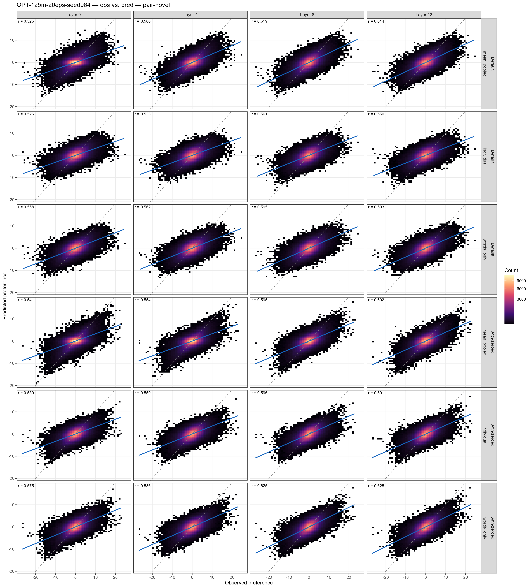
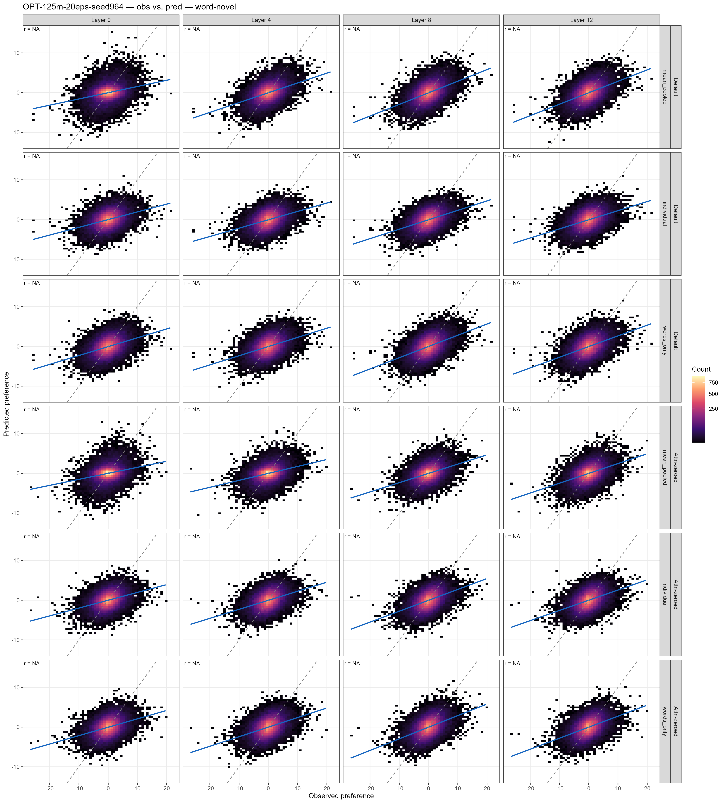
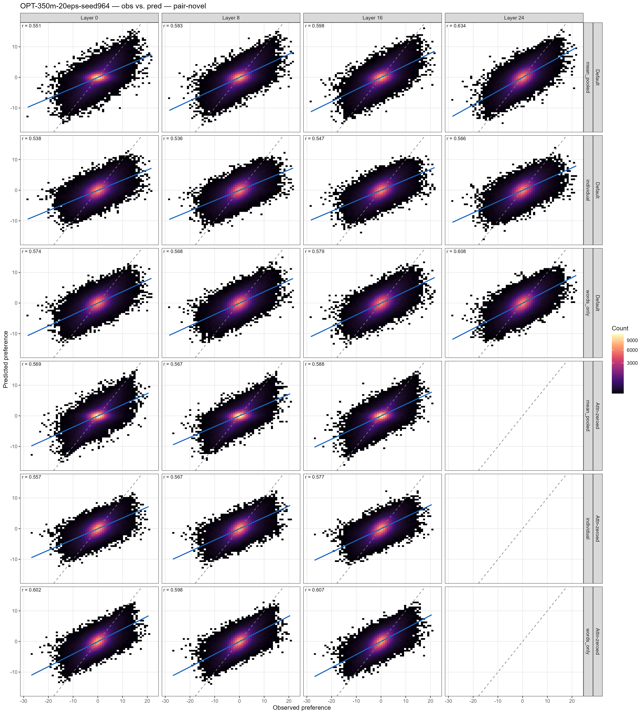
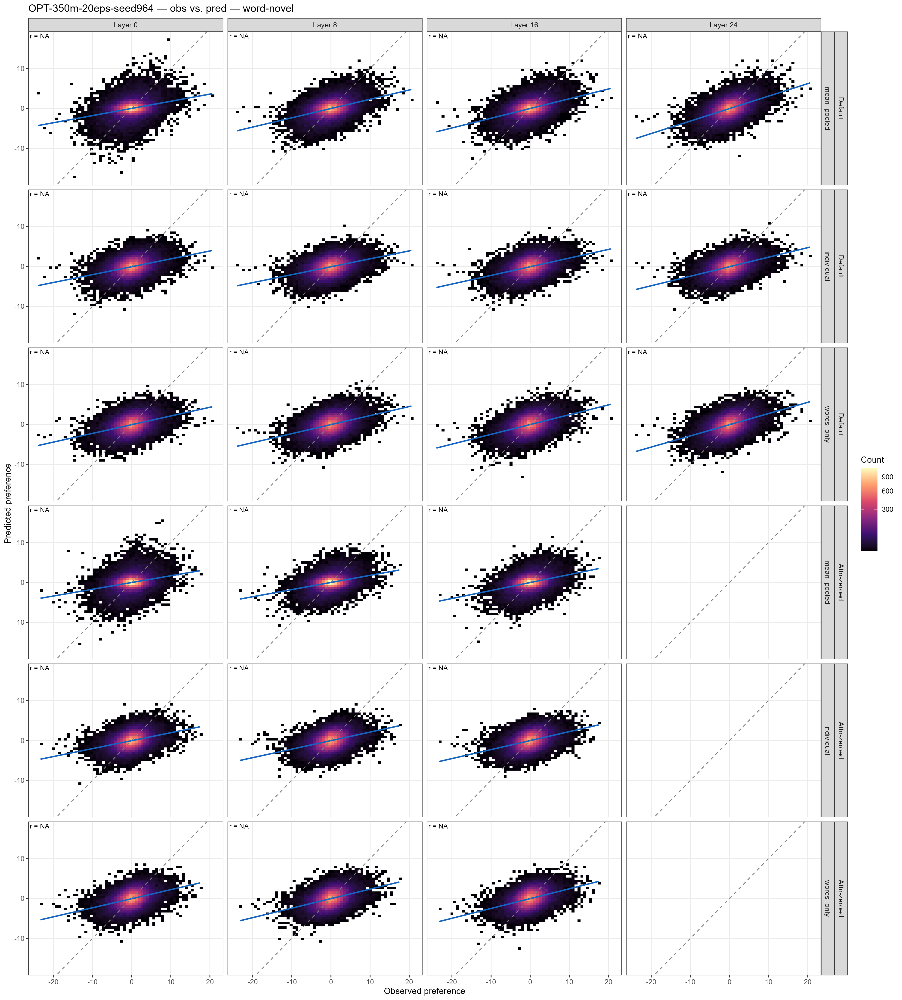

# Pilot Results 2: By-Layer MLP Analysis

Extends the last-layer probe results in `pilot_results.md` to every hidden layer, and introduces an attention-zeroed embedding condition. For each layer, an MLP is trained to predict binomial ordering preference from per-word hidden states extracted at that layer. Two embedding conditions (default vs. attention-zeroed), three input modes, and two CV splits are crossed, with an additional novel→corpus transfer analysis for frequency regression.

Plots are generated by `Scripts/plot_by_layer_results.R`:

```bash
Rscript Scripts/plot_by_layer_results.R --model-slug <slug>
# For scatter plots, also set RETICULATE_PYTHON to a Python with numpy
```

---

## Setup

### Embedding conditions

| Condition | Description |
|---|---|
| **default** | Full attention; words can attend to each other in the binomial sentence context |
| **attn_zeroed** | Cross-word attention zeroed out at extraction time; each word processed more in isolation |

### Input modes

| Mode | Input to MLP | Dim |
|---|---|---|
| **mean_pooled** | `[mean(w1, and, w2); mean(w2, and, w1)]` — mean of all three tokens for each ordering | 2×D |
| **individual** | `[H(w1); H(and); H(w2)]` from alpha-order sentence only; antisymmetric augmentation during training | 3×D |
| **words_only** | `[H(w1 in first position); H(w2 in first position)]` — each word from the sentence where it appears first; no "and" token | 2×D |

### CV splits

| Split | Description |
|---|---|
| **pair_novel** | 10-fold CV; pairs as held-out units |
| **word_novel** | 10-fold CV; both words of a pair must be unseen in training |

### MLP architecture

Hidden dim = 128; ReLU; Adam (lr=1e-3, weight decay=1e-4); early stopping (patience=20); batch=4096; antisymmetric augmentation (flip pair order + negate label with p=0.5).

### Controls

Each condition × model is also run with shuffled labels (selectivity check). Control r² is shown as dashed lines of the same colour on the r² by layer plots.

---

## Results: OPT-125M (12 layers)

### r² by layer

Solid lines = observed; dashed lines of same colour = shuffled-label control.


### pair_novel r² by layer

| Layer | default / mean_pooled | default / individual | default / words_only | attn_zeroed / mean_pooled | attn_zeroed / individual | attn_zeroed / words_only |
|---:|---:|---:|---:|---:|---:|---:|
| 0  | .272 | .273 | .309 | .293 | .286 | .328 |
| 1  | .314 | .257 | .300 | .289 | .285 | .320 |
| 2  | .321 | .263 | .301 | .289 | .291 | .325 |
| 3  | .330 | .270 | .308 | .298 | .300 | .334 |
| 4  | .339 | .278 | .314 | .319 | .309 | .344 |
| 5  | .353 | .290 | .326 | .338 | .334 | .364 |
| 6  | .369 | .303 | .343 | .355 | .352 | .381 |
| 7  | .376 | .304 | .347 | .363 | .355 | .384 |
| 8  | .379 | .308 | .351 | .369 | .356 | .389 |
| 9  | .381 | .306 | .353 | .371 | .353 | .390 |
| 10 | .378 | .305 | .349 | .369 | .351 | .389 |
| 11 | .372 | .299 | .342 | .367 | .342 | .382 |
| 12 | .372 | .294 | .344 | .369 | .347 | .386 |

### word_novel r² by layer

| Layer | default / mean_pooled | default / individual | default / words_only | attn_zeroed / mean_pooled | attn_zeroed / individual | attn_zeroed / words_only |
|---:|---:|---:|---:|---:|---:|---:|
| 0  | .081 | .118 | .135 | .072 | .110 | .120 |
| 1  | .138 | .112 | .130 | .089 | .111 | .123 |
| 2  | .142 | .121 | .134 | .088 | .121 | .123 |
| 3  | .150 | .124 | .146 | .096 | .126 | .136 |
| 4  | .171 | .133 | .150 | .112 | .138 | .143 |
| 5  | .178 | .143 | .156 | .137 | .149 | .158 |
| 6  | .196 | .147 | .176 | .153 | .174 | .180 |
| 7  | .203 | .152 | .185 | .160 | .175 | .183 |
| 8  | .206 | .159 | .196 | .167 | .178 | .188 |
| 9  | .213 | .160 | .191 | .167 | .171 | .189 |
| 10 | .211 | .155 | .187 | .169 | .174 | .187 |
| 11 | .208 | .146 | .184 | .166 | .167 | .181 |
| 12 | .205 | .146 | .183 | .165 | .165 | .187 |

**Key observations (125M):**
- Both conditions improve monotonically through ~layers 8–9, then plateau. No strong peak-then-drop.
- attn_zeroed meets or exceeds default on pair_novel in later layers, particularly for `words_only` (e.g., layer 8: .389 vs .351). The cross-word attention signal doesn't appear necessary for ordering prediction.
- `mean_pooled` and `words_only` outperform `individual` on pair_novel throughout; `individual` catches up more on word_novel.
- word_novel is substantially lower than pair_novel (generalization to unseen word combinations is harder), but improves across layers similarly.

### Observed vs. predicted — pair-novel split (key layers)



### Observed vs. predicted — word-novel split (key layers)



### Corpus-frequency analysis

MLP trained on all novel pairs (~340k), tested on corpus pairs (~49k). For each condition × layer × mode, `lm(residual ~ log(freq))` was fit where `residual = y_true − y_pred` and `freq = freq_w1_w2 + freq_w2_w1` from corpus. A negative coefficient means higher-frequency pairs have more negative residuals (i.e., the MLP overpredicts their alpha preference relative to what's actually observed).

#### default condition

##### mean_pooled

| Layer | β | 95% CI | p |
|---:|---:|---|---|
| 0  | −0.032 | [−0.073,  0.009] | .125 |
| 1  | −0.039 | [−0.078,  0.001] | .057 |
| 2  | −0.013 | [−0.052,  0.027] | .528 |
| 3  | −0.002 | [−0.041,  0.037] | .912 |
| 4  | −0.036 | [−0.075,  0.003] | .072 |
| 5  | −0.033 | [−0.071,  0.006] | .096 |
| 6  | −0.024 | [−0.061,  0.014] | .217 |
| 7  | −0.016 | [−0.054,  0.022] | .406 |
| 8  | −0.032 | [−0.070,  0.005] | .087 |
| 9  | −0.002 | [−0.039,  0.035] | .902 |
| 10 | −0.055 | [−0.093, −0.018] | .004 ** |
| 11 | −0.021 | [−0.058,  0.016] | .272 |
| 12 | −0.033 | [−0.070,  0.004] | .080 |

##### individual

| Layer | β | 95% CI | p |
|---:|---:|---|---|
| 0  | −0.013 | [−0.052,  0.025] | .496 |
| 1  |  0.003 | [−0.036,  0.042] | .873 |
| 2  | −0.003 | [−0.042,  0.036] | .875 |
| 3  | −0.031 | [−0.070,  0.008] | .116 |
| 4  | −0.025 | [−0.064,  0.013] | .199 |
| 5  | −0.055 | [−0.094, −0.017] | .005 ** |
| 6  | −0.074 | [−0.113, −0.036] | .0002 *** |
| 7  | −0.031 | [−0.069,  0.007] | .109 |
| 8  |  0.015 | [−0.022,  0.053] | .425 |
| 9  | −0.006 | [−0.044,  0.032] | .758 |
| 10 | −0.107 | [−0.145, −0.069] | <.0001 *** |
| 11 | −0.046 | [−0.083, −0.008] | .017 * |
| 12 | −0.049 | [−0.087, −0.012] | .010 ** |

##### words_only

| Layer | β | 95% CI | p |
|---:|---:|---|---|
| 0  | −0.018 | [−0.057,  0.020] | .354 |
| 1  |  0.010 | [−0.028,  0.049] | .605 |
| 2  | −0.022 | [−0.061,  0.017] | .270 |
| 3  |  0.018 | [−0.021,  0.057] | .366 |
| 4  | −0.025 | [−0.063,  0.014] | .208 |
| 5  | −0.032 | [−0.070,  0.006] | .098 |
| 6  |  0.006 | [−0.032,  0.043] | .764 |
| 7  | −0.015 | [−0.052,  0.023] | .443 |
| 8  | −0.019 | [−0.056,  0.018] | .321 |
| 9  | −0.015 | [−0.053,  0.022] | .416 |
| 10 | −0.013 | [−0.050,  0.025] | .509 |
| 11 | −0.047 | [−0.084, −0.010] | .014 * |
| 12 | −0.012 | [−0.050,  0.025] | .514 |

#### attn_zeroed condition

##### mean_pooled

| Layer | β | 95% CI | p |
|---:|---:|---|---|
| 0  |  0.004 | [−0.035,  0.042] | .852 |
| 1  | −0.023 | [−0.062,  0.015] | .237 |
| 2  |  0.024 | [−0.015,  0.063] | .230 |
| 3  |  0.032 | [−0.007,  0.071] | .104 |
| 4  |  0.012 | [−0.026,  0.050] | .536 |
| 5  | −0.018 | [−0.056,  0.019] | .331 |
| 6  | −0.025 | [−0.061,  0.012] | .189 |
| 7  | −0.037 | [−0.074, −0.001] | .045 * |
| 8  | −0.011 | [−0.047,  0.025] | .543 |
| 9  | −0.035 | [−0.071,  0.001] | .056 |
| 10 | −0.025 | [−0.061,  0.012] | .185 |
| 11 |  0.002 | [−0.034,  0.039] | .894 |
| 12 |  0.009 | [−0.028,  0.046] | .632 |

##### individual

| Layer | β | 95% CI | p |
|---:|---:|---|---|
| 0  |  0.005 | [−0.033,  0.042] | .795 |
| 1  | −0.012 | [−0.049,  0.026] | .536 |
| 2  |  0.016 | [−0.021,  0.052] | .403 |
| 3  |  0.009 | [−0.028,  0.045] | .645 |
| 4  |  0.000 | [−0.036,  0.037] | .983 |
| 5  |  0.003 | [−0.033,  0.039] | .868 |
| 6  | −0.018 | [−0.052,  0.017] | .323 |
| 7  | −0.038 | [−0.074, −0.003] | .036 * |
| 8  |  0.007 | [−0.028,  0.042] | .688 |
| 9  | −0.002 | [−0.036,  0.033] | .930 |
| 10 | −0.038 | [−0.073, −0.003] | .035 * |
| 11 | −0.018 | [−0.053,  0.018] | .322 |
| 12 |  0.001 | [−0.035,  0.036] | .966 |

##### words_only

| Layer | β | 95% CI | p |
|---:|---:|---|---|
| 0  | −0.011 | [−0.049,  0.026] | .558 |
| 1  | −0.027 | [−0.065,  0.011] | .162 |
| 2  | −0.020 | [−0.058,  0.017] | .288 |
| 3  |  0.010 | [−0.028,  0.048] | .600 |
| 4  |  0.013 | [−0.024,  0.050] | .498 |
| 5  | −0.004 | [−0.041,  0.032] | .811 |
| 6  |  0.011 | [−0.025,  0.046] | .566 |
| 7  | −0.010 | [−0.045,  0.026] | .599 |
| 8  | −0.023 | [−0.058,  0.011] | .187 |
| 9  |  0.003 | [−0.032,  0.039] | .850 |
| 10 | −0.013 | [−0.049,  0.022] | .469 |
| 11 | −0.001 | [−0.037,  0.034] | .948 |
| 12 | −0.024 | [−0.059,  0.011] | .184 |

**Overall pattern:** Effects are small and inconsistent across layers in most conditions. The `individual` mode under the default condition shows the clearest signal, with a cluster of negative coefficients at layers 5–6 and 10–12, strongest at layer 10 (β = −0.107). The attn_zeroed condition shows no consistent pattern. With 78 models fit, ~4 false positives are expected at α = .05, so isolated significant results should be interpreted cautiously; only the layer 10 `individual` / default result (p < .0001) is robust to this concern.

---

## Results: OPT-350M (24 layers)

### r² by layer

Solid lines = observed; dashed lines of same colour = shuffled-label control.


### pair_novel r² by layer

| Layer | default / mean_pooled | default / individual | default / words_only | attn_zeroed / mean_pooled | attn_zeroed / individual | attn_zeroed / words_only |
|---:|---:|---:|---:|---:|---:|---:|
| 0  | .300 | .284 | .326 | .319 | .306 | .355 |
| 1  | .318 | .286 | .321 | .309 | .308 | .350 |
| 2  | .329 | .283 | .320 | .304 | .311 | .355 |
| 3  | .337 | .284 | .321 | .307 | .314 | .354 |
| 4  | .335 | .282 | .323 | .309 | .314 | .355 |
| 5  | .334 | .279 | .320 | .312 | .312 | .355 |
| 6  | .334 | .279 | .320 | .312 | .315 | .355 |
| 7  | .334 | .279 | .320 | .319 | .315 | .357 |
| 8  | .335 | .279 | .320 | .323 | .316 | .354 |
| 9  | .340 | .279 | .321 | .330 | .318 | .358 |
| 10 | .339 | .281 | .322 | .334 | .316 | .356 |
| 11 | .345 | .285 | .322 | .335 | .320 | .360 |
| 12 | .347 | .286 | .322 | .340 | .323 | .360 |
| 13 | .352 | .290 | .328 | .343 | .325 | .365 |
| 14 | .354 | .292 | .331 | .349 | .329 | .366 |
| 15 | .353 | .293 | .330 | .350 | .328 | .366 |
| 16 | .356 | .292 | .330 | .352 | .328 | .367 |
| 17 | .357 | .295 | .331 | .355 | .331 | .367 |
| 18 | .365 | .298 | .331 | .355 | .330 | .368 |
| 19 | .367 | .298 | .332 | .356 | .334 | .367 |
| 20 | .378 | .309 | .345 | .383 | .350 | .383 |
| 21 | .402 | .319 | .364 | .403 | .378 | .411 |
| 22 | .408 | .323 | .372 | .411 | .379 | .420 |
| 23 | .406 | .321 | .373 | .414 | .375 | .420 |
| 24 | .399 | .313 | .365 | .407 | .370 | .414 |

### word_novel r² by layer

| Layer | default / mean_pooled | default / individual | default / words_only | attn_zeroed / mean_pooled | attn_zeroed / individual | attn_zeroed / words_only |
|---:|---:|---:|---:|---:|---:|---:|
| 0  | .086 | .117 | .125 | .074 | .110 | .121 |
| 1  | .117 | .119 | .132 | .076 | .114 | .129 |
| 2  | .134 | .118 | .131 | .079 | .121 | .134 |
| 3  | .146 | .120 | .133 | .089 | .120 | .132 |
| 4  | .142 | .116 | .134 | .092 | .118 | .134 |
| 5  | .139 | .118 | .137 | .095 | .117 | .131 |
| 6  | .145 | .116 | .134 | .094 | .115 | .140 |
| 7  | .143 | .117 | .136 | .098 | .116 | .138 |
| 8  | .152 | .114 | .142 | .107 | .121 | .137 |
| 9  | .149 | .123 | .140 | .108 | .122 | .142 |
| 10 | .156 | .117 | .142 | .106 | .121 | .141 |
| 11 | .159 | .126 | .142 | .107 | .124 | .144 |
| 12 | .162 | .125 | .140 | .106 | .124 | .140 |
| 13 | .170 | .129 | .151 | .110 | .125 | .149 |
| 14 | .169 | .133 | .151 | .107 | .126 | .149 |
| 15 | .170 | .137 | .149 | .114 | .127 | .154 |
| 16 | .168 | .133 | .153 | .111 | .131 | .152 |
| 17 | .171 | .137 | .159 | .119 | .132 | .149 |
| 18 | .177 | .136 | .153 | .119 | .134 | .151 |
| 19 | .178 | .139 | .161 | .117 | .139 | .156 |
| 20 | .192 | .144 | .162 | .149 | .150 | .167 |
| 21 | .219 | .154 | .183 | .172 | .178 | .191 |
| 22 | .226 | .161 | .194 | .181 | .181 | .202 |
| 23 | .235 | .160 | .197 | .176 | .184 | .208 |
| 24 | .229 | .157 | .188 | .189 | .168 | .207 |

**Key observations (350M):**
- Both conditions improve gradually through layers 1–20, then accelerate sharply at layers 21–23 before a slight drop at layer 24. The late-layer peak is more pronounced than in 125M.
- attn_zeroed meets or exceeds default on pair_novel in later layers, most clearly for `words_only` (layer 23: .420 vs .373) and `mean_pooled` (layer 23: .414 vs .406). Cross-word attention appears unnecessary for ordering prediction.
- `words_only` is the strongest mode for attn_zeroed throughout; `individual` is consistently lowest for default.
- word_novel is substantially lower for attn_zeroed than default in early layers (layer 0: .074 vs .086 for mean_pooled) but converges by the final layers.
- Layer 0 starts higher than 125M across the board, consistent with a larger embedding space.

### Observed vs. predicted — pair-novel split (key layers)



### Observed vs. predicted — word-novel split (key layers)



### Corpus-frequency analysis

MLP trained on all novel pairs (~340k), tested on corpus pairs (~49k). For each condition × layer × mode, `lm(residual ~ log(freq))` was fit where `residual = y_true − y_pred`. A negative coefficient means higher-frequency pairs have more negative residuals (MLP overpredicts their alpha preference).

#### default condition

##### mean_pooled

| Layer | β | 95% CI | p |
|---:|---:|---|---|
| 0  | −0.053 | [−0.093, −0.014] | .009 ** |
| 1  |  0.001 | [−0.038,  0.041] | .944 |
| 2  | −0.024 | [−0.063,  0.016] | .238 |
| 3  |  0.014 | [−0.025,  0.053] | .481 |
| 4  | −0.010 | [−0.049,  0.029] | .614 |
| 5  | −0.024 | [−0.062,  0.015] | .232 |
| 6  | −0.041 | [−0.080, −0.003] | .037 * |
| 7  |  0.009 | [−0.030,  0.047] | .659 |
| 8  | −0.013 | [−0.052,  0.026] | .521 |
| 9  | −0.012 | [−0.051,  0.028] | .562 |
| 10 | −0.012 | [−0.051,  0.027] | .561 |
| 11 |  0.028 | [−0.011,  0.067] | .161 |
| 12 | −0.015 | [−0.054,  0.023] | .436 |
| 13 | −0.023 | [−0.062,  0.016] | .247 |
| 14 | −0.013 | [−0.051,  0.026] | .524 |
| 15 | −0.008 | [−0.046,  0.031] | .694 |
| 16 | −0.012 | [−0.051,  0.026] | .527 |
| 17 | −0.039 | [−0.077, −0.001] | .047 * |
| 18 | −0.043 | [−0.082, −0.005] | .027 * |
| 19 |  0.011 | [−0.027,  0.049] | .580 |
| 20 |  0.026 | [−0.012,  0.063] | .177 |
| 21 | −0.047 | [−0.083, −0.011] | .011 * |
| 22 |  0.018 | [−0.018,  0.054] | .322 |
| 23 |  0.030 | [−0.006,  0.065] | .104 |
| 24 |  0.030 | [−0.006,  0.066] | .105 |

##### individual

| Layer | β | 95% CI | p |
|---:|---:|---|---|
| 0  | −0.031 | [−0.069,  0.007] | .115 |
| 1  | −0.012 | [−0.050,  0.026] | .538 |
| 2  | −0.008 | [−0.047,  0.030] | .672 |
| 3  |  0.005 | [−0.034,  0.044] | .804 |
| 4  | −0.021 | [−0.059,  0.018] | .292 |
| 5  | −0.013 | [−0.051,  0.025] | .500 |
| 6  | −0.047 | [−0.085, −0.009] | .017 * |
| 7  | −0.031 | [−0.069,  0.008] | .120 |
| 8  | −0.005 | [−0.043,  0.034] | .811 |
| 9  |  0.018 | [−0.020,  0.056] | .353 |
| 10 |  0.019 | [−0.019,  0.057] | .334 |
| 11 |  0.004 | [−0.034,  0.043] | .823 |
| 12 | −0.001 | [−0.039,  0.037] | .956 |
| 13 |  0.011 | [−0.027,  0.049] | .566 |
| 14 |  0.004 | [−0.033,  0.041] | .828 |
| 15 | −0.031 | [−0.069,  0.007] | .114 |
| 16 |  0.068 | [  0.030,  0.105] | .0004 *** |
| 17 |  0.011 | [−0.026,  0.049] | .554 |
| 18 | −0.032 | [−0.069,  0.006] | .099 |
| 19 |  0.006 | [−0.032,  0.043] | .767 |
| 20 |  0.037 | [  0.000,  0.074] | .050 |
| 21 | −0.052 | [−0.088, −0.015] | .006 ** |
| 22 | −0.047 | [−0.084, −0.011] | .012 * |
| 23 |  0.001 | [−0.035,  0.037] | .975 |
| 24 | −0.010 | [−0.047,  0.026] | .585 |

##### words_only

| Layer | β | 95% CI | p |
|---:|---:|---|---|
| 0  |  0.001 | [−0.038,  0.040] | .967 |
| 1  | −0.002 | [−0.040,  0.037] | .939 |
| 2  |  0.017 | [−0.022,  0.055] | .391 |
| 3  | −0.003 | [−0.041,  0.035] | .884 |
| 4  | −0.012 | [−0.050,  0.027] | .555 |
| 5  | −0.009 | [−0.047,  0.029] | .642 |
| 6  | −0.043 | [−0.081, −0.004] | .030 * |
| 7  |  0.015 | [−0.023,  0.053] | .448 |
| 8  |  0.011 | [−0.028,  0.050] | .582 |
| 9  | −0.013 | [−0.051,  0.026] | .518 |
| 10 |  0.003 | [−0.035,  0.041] | .885 |
| 11 |  0.008 | [−0.030,  0.047] | .664 |
| 12 | −0.001 | [−0.039,  0.037] | .958 |
| 13 | −0.018 | [−0.056,  0.019] | .341 |
| 14 |  0.001 | [−0.037,  0.038] | .976 |
| 15 |  0.034 | [−0.004,  0.073] | .078 |
| 16 | −0.013 | [−0.051,  0.025] | .501 |
| 17 |  0.000 | [−0.038,  0.038] | .989 |
| 18 | −0.031 | [−0.069,  0.006] | .105 |
| 19 |  0.027 | [−0.010,  0.064] | .156 |
| 20 |  0.017 | [−0.020,  0.055] | .368 |
| 21 |  0.001 | [−0.035,  0.038] | .943 |
| 22 | −0.018 | [−0.054,  0.018] | .319 |
| 23 | −0.023 | [−0.058,  0.012] | .198 |
| 24 |  0.016 | [−0.020,  0.052] | .384 |

#### attn_zeroed condition

##### mean_pooled

| Layer | β | 95% CI | p |
|---:|---:|---|---|
| 0  |  0.002 | [−0.034,  0.037] | .932 |
| 1  | −0.073 | [−0.110, −0.037] | .0001 *** |
| 2  | −0.023 | [−0.060,  0.013] | .215 |
| 3  | −0.051 | [−0.087, −0.014] | .007 ** |
| 4  | −0.034 | [−0.070,  0.002] | .068 |
| 5  | −0.020 | [−0.056,  0.016] | .276 |
| 6  |  0.014 | [−0.022,  0.051] | .444 |
| 7  | −0.037 | [−0.073,  0.000] | .048 * |
| 8  |  0.026 | [−0.010,  0.062] | .151 |
| 9  | −0.028 | [−0.065,  0.008] | .124 |
| 10 | −0.038 | [−0.074, −0.002] | .037 * |
| 11 | −0.022 | [−0.058,  0.014] | .228 |
| 12 |  0.006 | [−0.030,  0.042] | .748 |
| 13 | −0.047 | [−0.083, −0.011] | .010 ** |
| 14 | −0.023 | [−0.058,  0.013] | .206 |
| 15 | −0.039 | [−0.074, −0.003] | .033 * |
| 16 |  0.000 | [−0.036,  0.035] | .982 |
| 17 | −0.054 | [−0.090, −0.019] | .003 ** |
| 18 | −0.016 | [−0.052,  0.019] | .364 |
| 19 | −0.022 | [−0.057,  0.013] | .215 |
| 20 |  0.019 | [−0.015,  0.054] | .274 |
| 21 | −0.029 | [−0.063,  0.006] | .101 |
| 22 | −0.021 | [−0.054,  0.013] | .223 |
| 23 | −0.032 | [−0.065,  0.002] | .065 |
| 24 | −0.044 | [−0.078, −0.010] | .010 * |

##### individual

| Layer | β | 95% CI | p |
|---:|---:|---|---|
| 0  | −0.011 | [−0.045,  0.024] | .539 |
| 1  | −0.007 | [−0.041,  0.027] | .675 |
| 2  |  0.017 | [−0.018,  0.052] | .334 |
| 3  | −0.080 | [−0.114, −0.045] | <.0001 *** |
| 4  |  0.003 | [−0.032,  0.037] | .878 |
| 5  |  0.004 | [−0.031,  0.038] | .826 |
| 6  |  0.009 | [−0.025,  0.044] | .592 |
| 7  | −0.007 | [−0.042,  0.028] | .698 |
| 8  | −0.017 | [−0.051,  0.018] | .345 |
| 9  |  0.018 | [−0.016,  0.052] | .307 |
| 10 |  0.025 | [−0.009,  0.059] | .150 |
| 11 | −0.015 | [−0.050,  0.020] | .409 |
| 12 |  0.009 | [−0.025,  0.043] | .609 |
| 13 |  0.051 | [  0.017,  0.085] | .003 ** |
| 14 |  0.014 | [−0.020,  0.049] | .419 |
| 15 |  0.012 | [−0.023,  0.046] | .505 |
| 16 | −0.042 | [−0.076, −0.008] | .016 * |
| 17 |  0.011 | [−0.023,  0.046] | .515 |
| 18 | −0.007 | [−0.041,  0.027] | .674 |
| 19 |  0.031 | [−0.002,  0.065] | .063 |
| 20 |  0.004 | [−0.030,  0.037] | .836 |
| 21 |  0.004 | [−0.028,  0.037] | .805 |
| 22 |  0.007 | [−0.026,  0.040] | .673 |
| 23 |  0.021 | [−0.011,  0.053] | .199 |
| 24 |  0.000 | [−0.033,  0.032] | .994 |

##### words_only

| Layer | β | 95% CI | p |
|---:|---:|---|---|
| 0  | −0.046 | [−0.082, −0.011] | .010 * |
| 1  | −0.034 | [−0.069,  0.001] | .055 |
| 2  |  0.026 | [−0.009,  0.061] | .142 |
| 3  | −0.037 | [−0.072, −0.002] | .041 * |
| 4  | −0.032 | [−0.067,  0.003] | .074 |
| 5  | −0.004 | [−0.039,  0.031] | .823 |
| 6  | −0.007 | [−0.041,  0.027] | .686 |
| 7  | −0.022 | [−0.057,  0.013] | .220 |
| 8  | −0.018 | [−0.053,  0.018] | .328 |
| 9  |  0.007 | [−0.028,  0.042] | .691 |
| 10 | −0.007 | [−0.042,  0.028] | .697 |
| 11 |  0.002 | [−0.033,  0.037] | .907 |
| 12 | −0.014 | [−0.049,  0.021] | .422 |
| 13 |  0.011 | [−0.024,  0.046] | .528 |
| 14 |  0.003 | [−0.031,  0.037] | .858 |
| 15 | −0.041 | [−0.076, −0.007] | .019 * |
| 16 |  0.017 | [−0.019,  0.052] | .355 |
| 17 | −0.005 | [−0.040,  0.029] | .769 |
| 18 | −0.016 | [−0.050,  0.019] | .368 |
| 19 | −0.008 | [−0.042,  0.026] | .633 |
| 20 | −0.003 | [−0.036,  0.031] | .883 |
| 21 | −0.042 | [−0.074, −0.010] | .011 * |
| 22 |  0.017 | [−0.015,  0.050] | .295 |
| 23 | −0.008 | [−0.040,  0.024] | .624 |
| 24 | −0.023 | [−0.055,  0.010] | .168 |

**Overall pattern (350M):** More significant effects than 125M overall, but still mostly small and scattered. The default condition shows an anomalous positive effect at layer 16 / individual (β = +0.068, p = .0004), which may reflect a layer-specific representational quirk. The attn_zeroed / mean_pooled condition shows the most consistent negative pattern, with significant negative coefficients at layers 1, 3, 7, 10, 13, 15, 17, and 24 — suggesting frequency effects on MLP residuals are more robustly captured when cross-word attention is blocked. The attn_zeroed / individual condition has a strong negative peak at layer 3 (β = −0.080, p < .0001). With 150 models fit, ~8 false positives expected at α = .05; only effects with p < .01 are reliable on their own.

---

## Results: OPT-1.3B (24 layers)

*Pending.*

### r² by layer


### Observed vs. predicted — pair-novel split (key layers)


### Observed vs. predicted — word-novel split (key layers)


### Corpus-frequency analysis

*Pending.*

---

## Frequency strata PLS (old approach)

PLS trained on corpus pairs within each frequency bin, tested on novel pairs. All r² ≈ 0.001–0.013 across all layers, models, and strata — no meaningful frequency gradient. Superseded by the novel→corpus direction above.
