# Pilot Results 2: By-Layer MLP Analysis

Extends the last-layer probe results in `pilot_results.md` to every hidden layer, and introduces an attention-zeroed embedding condition. For each layer, an MLP is trained to predict binomial ordering preference from per-word hidden states extracted at that layer. Two embedding conditions (default vs. attention-zeroed), three input modes, and two CV splits are crossed, with an additional novel→corpus transfer analysis for frequency regression.

Plots are generated by `Scripts/plot_by_layer_results.R`:

```bash
Rscript Scripts/plot_by_layer_results.R --model-slug <slug>
# For scatter plots, also set RETICULATE_PYTHON to a Python with numpy
```

---

## Setup

### Embedding conditions

| Condition | Description |
|---|---|
| **default** | Full attention; words can attend to each other in the binomial sentence context |
| **attn_zeroed** | Cross-word attention zeroed out at extraction time; each word processed more in isolation |

### Input modes

| Mode | Input to MLP | Dim |
|---|---|---|
| **mean_pooled** | `[mean(w1, and, w2); mean(w2, and, w1)]` — mean of all three tokens for each ordering | 2×D |
| **individual** | `[H(w1); H(and); H(w2)]` from alpha-order sentence only; antisymmetric augmentation during training | 3×D |
| **words_only** | `[H(w1 in first position); H(w2 in first position)]` — each word from the sentence where it appears first; no "and" token | 2×D |

### CV splits

| Split | Description |
|---|---|
| **pair_novel** | 10-fold CV; pairs as held-out units |
| **word_novel** | 10-fold CV; both words of a pair must be unseen in training |

### MLP architecture

Hidden dim = 128; ReLU; Adam (lr=1e-3, weight decay=1e-4); early stopping (patience=20); batch=4096; antisymmetric augmentation (flip pair order + negate label with p=0.5).

### Controls

Each condition × model is also run with shuffled labels (selectivity check). Control r² is shown as dashed lines of the same colour on the r² by layer plots.

---

## Results: OPT-125M (12 layers)

### r² by layer

Solid lines = observed; dashed lines of same colour = shuffled-label control.

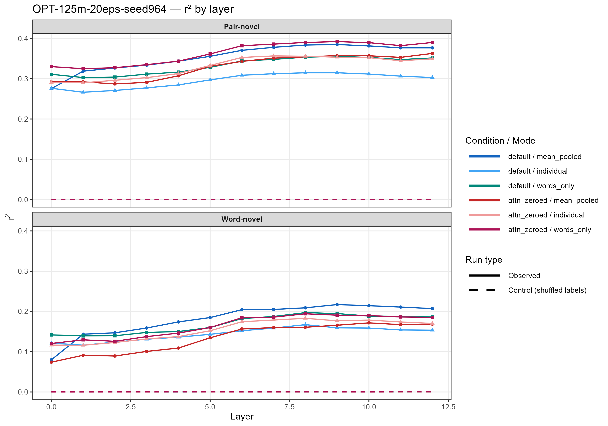

### pair_novel r² by layer

| Layer | default / mean_pooled | default / individual | default / words_only | attn_zeroed / mean_pooled | attn_zeroed / individual | attn_zeroed / words_only |
|---:|---:|---:|---:|---:|---:|---:|
| 0  | .276 | .276 | .311 | .292 | .291 | .330 |
| 1  | .319 | .266 | .303 | .292 | .290 | .325 |
| 2  | .327 | .271 | .304 | .287 | .296 | .327 |
| 3  | .334 | .277 | .311 | .291 | .303 | .335 |
| 4  | .344 | .285 | .316 | .307 | .313 | .344 |
| 5  | .356 | .297 | .328 | .331 | .333 | .362 |
| 6  | .371 | .309 | .344 | .343 | .353 | .382 |
| 7  | .378 | .313 | .348 | .351 | .357 | .386 |
| 8  | .384 | .315 | .354 | .355 | .356 | .390 |
| 9  | .385 | .315 | .355 | .357 | .354 | .392 |
| 10 | .382 | .312 | .353 | .357 | .352 | .390 |
| 11 | .377 | .306 | .348 | .353 | .345 | .382 |
| 12 | .377 | .303 | .352 | .363 | .350 | .390 |

### word_novel r² by layer

| Layer | default / mean_pooled | default / individual | default / words_only | attn_zeroed / mean_pooled | attn_zeroed / individual | attn_zeroed / words_only |
|---:|---:|---:|---:|---:|---:|---:|
| 0  | .080 | .121 | .142 | .074 | .116 | .120 |
| 1  | .143 | .116 | .139 | .091 | .116 | .130 |
| 2  | .147 | .124 | .140 | .089 | .123 | .126 |
| 3  | .159 | .131 | .148 | .101 | .132 | .138 |
| 4  | .174 | .136 | .150 | .109 | .138 | .146 |
| 5  | .185 | .143 | .160 | .135 | .152 | .160 |
| 6  | .204 | .152 | .182 | .156 | .174 | .184 |
| 7  | .205 | .159 | .188 | .160 | .179 | .186 |
| 8  | .209 | .167 | .197 | .161 | .183 | .194 |
| 9  | .217 | .159 | .195 | .166 | .177 | .191 |
| 10 | .214 | .159 | .189 | .172 | .179 | .190 |
| 11 | .211 | .154 | .188 | .167 | .174 | .186 |
| 12 | .207 | .153 | .186 | .168 | .170 | .185 |

**Key observations (125M):**
- Both conditions improve monotonically through layers 8–9, then plateau slightly. Peak pair_novel r²: default / mean_pooled = .385 (layer 9), attn_zeroed / words_only = .392 (layer 9).
- attn_zeroed exceeds default on pair_novel from around layer 5 onward, most clearly for `words_only` (layer 9: .392 vs .355) and `individual` (layer 7: .357 vs .313). Cross-word attention doesn't appear necessary for ordering prediction and may actually hurt.
- `mean_pooled` and `words_only` outperform `individual` on pair_novel in both conditions throughout; `individual` closes the gap somewhat on word_novel.
- word_novel is substantially lower than pair_novel overall (peak default / mean_pooled = .217 vs .385), but follows the same layer trajectory. attn_zeroed word_novel is lower than default in early layers but converges by layer 8.
- Controls are all r² < 0.001, confirming the probe is capturing a genuine signal and not fitting noise.

### Observed vs. predicted — pair-novel split (key layers)

**Default condition:**

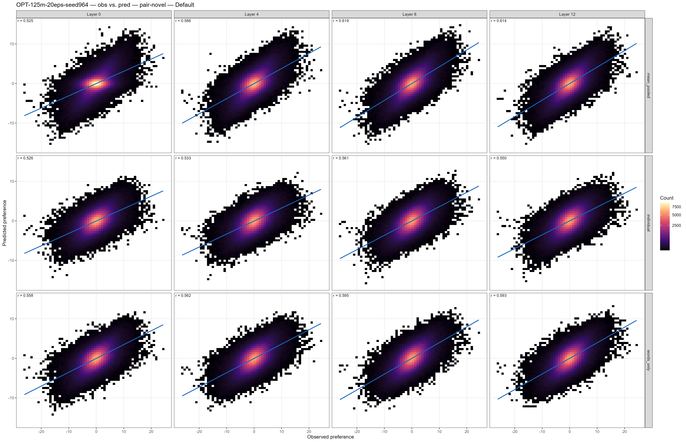

**Attention-zeroed condition:**

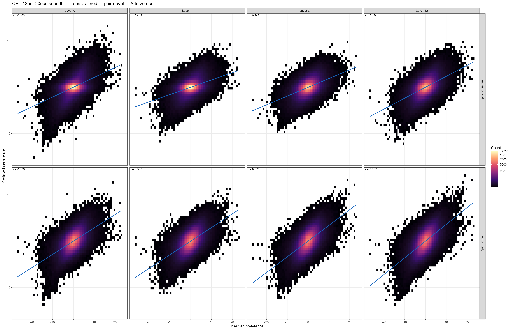

### Observed vs. predicted — word-novel split (key layers)

**Default condition:**

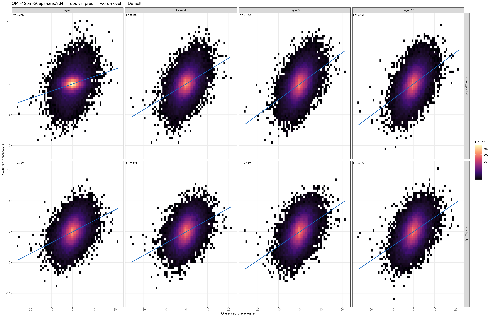

**Attention-zeroed condition:**

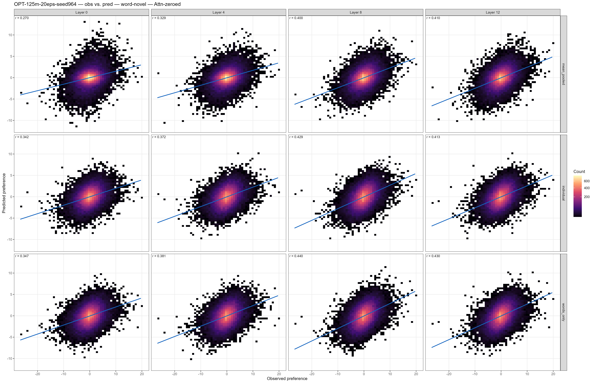

### Corpus-frequency analysis

MLP trained on all novel pairs (~340k), tested on corpus pairs (~49k). For each condition × layer × mode, `lm(|residual| ~ log(freq))` was fit where `|residual| = |y_true − y_pred|` and `freq = freq_w1_w2 + freq_w2_w1` from corpus. A negative β means higher-frequency pairs have lower absolute error (model is more accurate for them); a positive β means higher-frequency pairs have larger errors.

#### default condition

##### mean_pooled

| Layer | β | 95% CI | p |
|---:|---:|---|---|
| 0  | +0.081 | [+0.054, +0.107] | <.001 *** |
| 1  | +0.053 | [+0.027, +0.079] | <.001 *** |
| 2  | +0.047 | [+0.021, +0.073] | <.001 *** |
| 3  | +0.063 | [+0.038, +0.089] | <.001 *** |
| 4  | +0.072 | [+0.047, +0.097] | <.001 *** |
| 5  | +0.059 | [+0.034, +0.084] | <.001 *** |
| 6  | +0.055 | [+0.031, +0.079] | <.001 *** |
| 7  | +0.058 | [+0.034, +0.083] | <.001 *** |
| 8  | +0.058 | [+0.034, +0.081] | <.001 *** |
| 9  | +0.042 | [+0.018, +0.065] | <.001 *** |
| 10 | +0.048 | [+0.024, +0.071] | <.001 *** |
| 11 | +0.045 | [+0.021, +0.069] | <.001 *** |
| 12 | +0.039 | [+0.015, +0.063] | .001 ** |

##### individual

| Layer | β | 95% CI | p |
|---:|---:|---|---|
| 0  | +0.022 | [−0.003, +0.047] | .090 |
| 1  | +0.026 | [+0.001, +0.052] | .043 * |
| 2  | +0.020 | [−0.005, +0.046] | .112 |
| 3  | +0.019 | [−0.006, +0.044] | .138 |
| 4  | +0.019 | [−0.006, +0.044] | .130 |
| 5  | +0.026 | [+0.001, +0.050] | .043 * |
| 6  | +0.030 | [+0.005, +0.054] | .019 * |
| 7  | +0.018 | [−0.007, +0.042] | .156 |
| 8  | +0.024 | [−0.000, +0.048] | .051 |
| 9  | +0.028 | [+0.003, +0.052] | .026 * |
| 10 | +0.012 | [−0.013, +0.036] | .346 |
| 11 | +0.035 | [+0.010, +0.059] | .005 ** |
| 12 | +0.044 | [+0.020, +0.068] | <.001 *** |

##### words_only

| Layer | β | 95% CI | p |
|---:|---:|---|---|
| 0  |  0.000 | [−0.027, +0.024] | .898 |
| 1  | +0.025 | [−0.001, +0.050] | .056 |
| 2  | +0.015 | [−0.010, +0.040] | .250 |
| 3  | +0.007 | [−0.018, +0.032] | .584 |
| 4  | +0.009 | [−0.015, +0.034] | .454 |
| 5  | +0.032 | [+0.007, +0.056] | .011 * |
| 6  | +0.026 | [+0.002, +0.050] | .035 * |
| 7  | +0.032 | [+0.008, +0.056] | .008 ** |
| 8  | +0.022 | [−0.002, +0.046] | .070 |
| 9  | +0.023 | [−0.001, +0.046] | .060 |
| 10 | +0.024 | [−0.000, +0.047] | .050 |
| 11 | +0.038 | [+0.015, +0.062] | .002 ** |
| 12 | +0.024 | [+0.000, +0.048] | .046 * |

#### attn_zeroed condition

##### mean_pooled

| Layer | β | 95% CI | p |
|---:|---:|---|---|
| 0  | −0.068 | [−0.093, −0.042] | <.001 *** |
| 1  | −0.076 | [−0.101, −0.051] | <.001 *** |
| 2  | −0.055 | [−0.080, −0.029] | <.001 *** |
| 3  | −0.057 | [−0.082, −0.032] | <.001 *** |
| 4  | −0.058 | [−0.082, −0.033] | <.001 *** |
| 5  | −0.061 | [−0.085, −0.037] | <.001 *** |
| 6  | −0.065 | [−0.089, −0.042] | <.001 *** |
| 7  | −0.059 | [−0.083, −0.036] | <.001 *** |
| 8  | −0.076 | [−0.099, −0.053] | <.001 *** |
| 9  | −0.067 | [−0.090, −0.044] | <.001 *** |
| 10 | −0.048 | [−0.071, −0.025] | <.001 *** |
| 11 | −0.066 | [−0.089, −0.043] | <.001 *** |
| 12 | −0.070 | [−0.093, −0.047] | <.001 *** |

##### individual

| Layer | β | 95% CI | p |
|---:|---:|---|---|
| 0  | −0.098 | [−0.123, −0.074] | <.001 *** |
| 1  | −0.095 | [−0.119, −0.071] | <.001 *** |
| 2  | −0.091 | [−0.114, −0.067] | <.001 *** |
| 3  | −0.081 | [−0.105, −0.057] | <.001 *** |
| 4  | −0.092 | [−0.115, −0.068] | <.001 *** |
| 5  | −0.076 | [−0.099, −0.053] | <.001 *** |
| 6  | −0.080 | [−0.102, −0.058] | <.001 *** |
| 7  | −0.067 | [−0.090, −0.044] | <.001 *** |
| 8  | −0.069 | [−0.091, −0.047] | <.001 *** |
| 9  | −0.088 | [−0.110, −0.065] | <.001 *** |
| 10 | −0.082 | [−0.104, −0.059] | <.001 *** |
| 11 | −0.067 | [−0.090, −0.044] | <.001 *** |
| 12 | −0.078 | [−0.101, −0.056] | <.001 *** |

##### words_only

| Layer | β | 95% CI | p |
|---:|---:|---|---|
| 0  | −0.104 | [−0.129, −0.080] | <.001 *** |
| 1  | −0.099 | [−0.123, −0.074] | <.001 *** |
| 2  | −0.084 | [−0.108, −0.060] | <.001 *** |
| 3  | −0.073 | [−0.097, −0.049] | <.001 *** |
| 4  | −0.084 | [−0.108, −0.060] | <.001 *** |
| 5  | −0.078 | [−0.101, −0.054] | <.001 *** |
| 6  | −0.072 | [−0.095, −0.049] | <.001 *** |
| 7  | −0.059 | [−0.082, −0.037] | <.001 *** |
| 8  | −0.066 | [−0.089, −0.044] | <.001 *** |
| 9  | −0.076 | [−0.098, −0.053] | <.001 *** |
| 10 | −0.071 | [−0.093, −0.048] | <.001 *** |
| 11 | −0.077 | [−0.100, −0.054] | <.001 *** |
| 12 | −0.087 | [−0.110, −0.065] | <.001 *** |

**Overall pattern (125M):** A clean dissociation by condition across all 13 layers. All three attn_zeroed modes show consistently negative β (all p < .001) — the model is more accurate for higher-frequency binomials when cross-word attention is blocked. Default/mean_pooled shows the mirror pattern: consistently positive β across all layers (all p < .01), meaning the model is less accurate for higher-frequency pairs when attention is active and representations are mean-pooled. Default/individual and default/words_only show smaller, noisier positive effects that reach significance mainly in the last few layers.

---

## Results: OPT-350M (24 layers)

### r² by layer

Solid lines = observed; dashed lines of same colour = shuffled-label control (partial — controls still running).

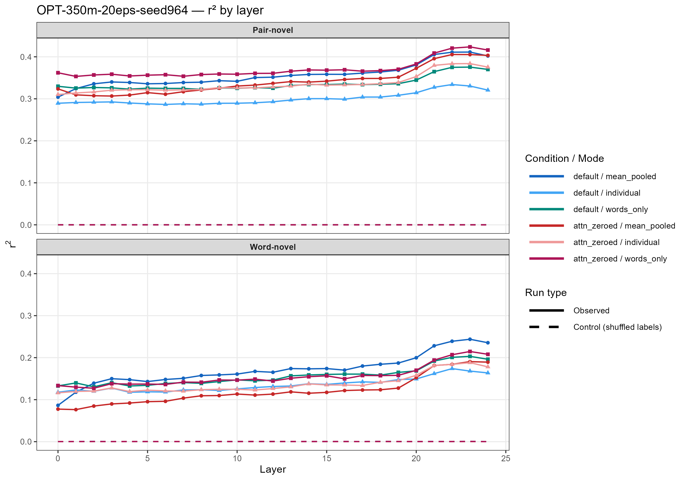

### pair_novel r² by layer

| Layer | default / mean_pooled | default / individual | default / words_only | attn_zeroed / mean_pooled | attn_zeroed / individual | attn_zeroed / words_only |
|---:|---:|---:|---:|---:|---:|---:|
| 0  | .304 | .289 | .330 | .324 | .310 | .362 |
| 1  | .324 | .291 | .325 | .309 | .314 | .353 |
| 2  | .336 | .292 | .327 | .307 | .316 | .357 |
| 3  | .340 | .293 | .326 | .307 | .321 | .359 |
| 4  | .339 | .290 | .323 | .309 | .322 | .354 |
| 5  | .336 | .288 | .325 | .315 | .322 | .356 |
| 6  | .336 | .287 | .325 | .311 | .320 | .357 |
| 7  | .339 | .288 | .325 | .317 | .321 | .354 |
| 8  | .340 | .287 | .323 | .321 | .322 | .358 |
| 9  | .343 | .289 | .326 | .325 | .327 | .359 |
| 10 | .342 | .289 | .325 | .330 | .326 | .359 |
| 11 | .351 | .291 | .327 | .333 | .326 | .361 |
| 12 | .351 | .293 | .325 | .337 | .328 | .361 |
| 13 | .356 | .297 | .332 | .341 | .330 | .366 |
| 14 | .358 | .300 | .334 | .340 | .335 | .369 |
| 15 | .358 | .300 | .334 | .342 | .333 | .368 |
| 16 | .358 | .299 | .335 | .346 | .333 | .369 |
| 17 | .361 | .304 | .334 | .348 | .334 | .366 |
| 18 | .364 | .304 | .335 | .348 | .336 | .367 |
| 19 | .368 | .308 | .336 | .351 | .339 | .370 |
| 20 | .381 | .314 | .345 | .373 | .353 | .383 |
| 21 | .405 | .327 | .365 | .396 | .380 | .409 |
| 22 | .411 | .334 | .375 | .405 | .384 | .421 |
| 23 | .411 | .330 | .376 | .405 | .384 | .424 |
| 24 | .402 | .321 | .370 | .403 | .375 | .416 |

### word_novel r² by layer

| Layer | default / mean_pooled | default / individual | default / words_only | attn_zeroed / mean_pooled | attn_zeroed / individual | attn_zeroed / words_only |
|---:|---:|---:|---:|---:|---:|---:|
| 0  | .086 | .118 | .133 | .078 | .116 | .133 |
| 1  | .118 | .123 | .140 | .076 | .120 | .130 |
| 2  | .139 | .120 | .131 | .085 | .120 | .127 |
| 3  | .150 | .128 | .140 | .090 | .128 | .138 |
| 4  | .148 | .118 | .133 | .092 | .119 | .137 |
| 5  | .143 | .119 | .134 | .095 | .123 | .137 |
| 6  | .148 | .118 | .139 | .096 | .121 | .136 |
| 7  | .151 | .123 | .141 | .104 | .120 | .142 |
| 8  | .158 | .124 | .139 | .109 | .124 | .141 |
| 9  | .159 | .122 | .143 | .110 | .125 | .147 |
| 10 | .161 | .126 | .147 | .113 | .125 | .147 |
| 11 | .167 | .129 | .145 | .111 | .123 | .149 |
| 12 | .165 | .131 | .146 | .113 | .126 | .144 |
| 13 | .174 | .133 | .157 | .119 | .130 | .151 |
| 14 | .173 | .138 | .159 | .115 | .138 | .155 |
| 15 | .174 | .136 | .160 | .117 | .135 | .157 |
| 16 | .170 | .140 | .161 | .122 | .135 | .150 |
| 17 | .180 | .142 | .161 | .123 | .134 | .158 |
| 18 | .184 | .141 | .158 | .124 | .141 | .157 |
| 19 | .187 | .148 | .165 | .128 | .145 | .158 |
| 20 | .200 | .149 | .169 | .152 | .158 | .170 |
| 21 | .228 | .162 | .192 | .181 | .181 | .194 |
| 22 | .239 | .174 | .201 | .184 | .184 | .207 |
| 23 | .244 | .168 | .203 | .191 | .188 | .215 |
| 24 | .236 | .164 | .196 | .189 | .178 | .208 |

**Key observations (350M):**
- Both conditions improve gradually through layers 1–20, then accelerate sharply at layers 21–23 before a slight drop at layer 24. The late-layer peak is more pronounced than in 125M.
- attn_zeroed meets or exceeds default on pair_novel in later layers, most clearly for `words_only` (layer 23: .424 vs .376) and `mean_pooled` (layers 22–23: .405 vs .411). Cross-word attention appears unnecessary for ordering prediction.
- `words_only` is the strongest mode for attn_zeroed throughout; `individual` is consistently lowest for default.
- word_novel is substantially lower for attn_zeroed than default in early layers (layer 0: .078 vs .086 for mean_pooled) but converges and slightly exceeds default by layers 22–23.
- Layer 0 starts higher than 125M across the board, consistent with a larger embedding space.

### Observed vs. predicted — pair-novel split (key layers)

**Default condition:**
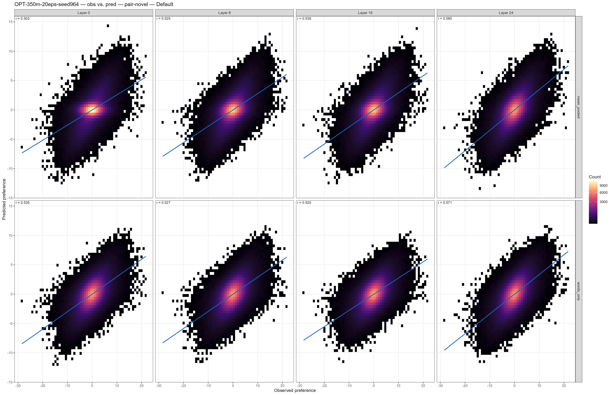

**Attention-zeroed condition:**
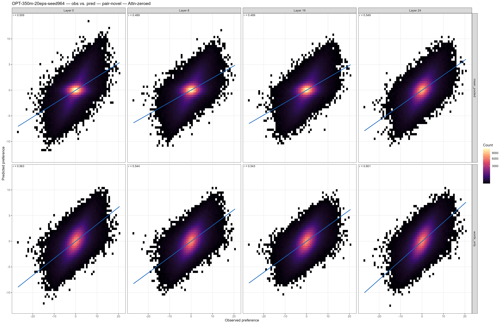

### Observed vs. predicted — word-novel split (key layers)

**Default condition:**
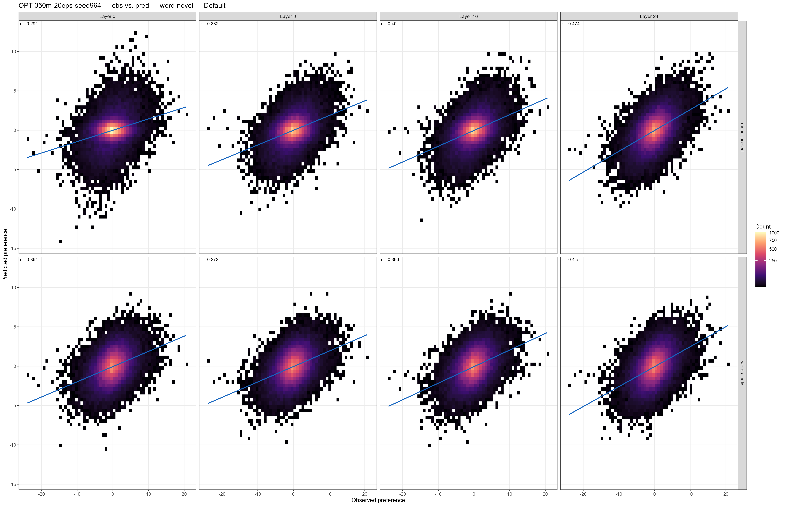

**Attention-zeroed condition:**
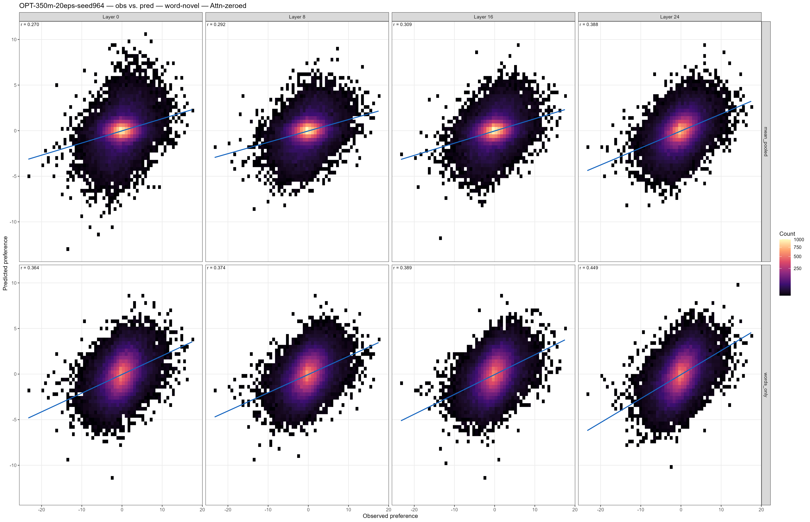

### Corpus-frequency analysis

MLP trained on all novel pairs (~340k), tested on corpus pairs (~49k). For each condition × layer × mode, `lm(|residual| ~ log(freq))` was fit where `|residual| = |y_true − y_pred|` and `freq = freq_w1_w2 + freq_w2_w1` from corpus. A negative β means higher-frequency pairs have lower absolute error (model is more accurate for them); a positive β means higher-frequency pairs have larger errors.

#### default condition

##### mean_pooled

| Layer | β | 95% CI | p |
|---:|---:|---|---|
| 0  | +0.060 | [+0.034, +0.086] | <.001 *** |
| 1  | +0.047 | [+0.021, +0.072] | <.001 *** |
| 2  | +0.049 | [+0.024, +0.075] | <.001 *** |
| 3  | +0.055 | [+0.029, +0.080] | <.001 *** |
| 4  | +0.055 | [+0.030, +0.080] | <.001 *** |
| 5  | +0.049 | [+0.024, +0.074] | <.001 *** |
| 6  | +0.054 | [+0.029, +0.079] | <.001 *** |
| 7  | +0.040 | [+0.015, +0.065] | .002 ** |
| 8  | +0.050 | [+0.025, +0.075] | <.001 *** |
| 9  | +0.064 | [+0.039, +0.090] | <.001 *** |
| 10 | +0.056 | [+0.031, +0.081] | <.001 *** |
| 11 | +0.037 | [+0.012, +0.062] | .004 ** |
| 12 | +0.057 | [+0.032, +0.082] | <.001 *** |
| 13 | +0.054 | [+0.029, +0.079] | <.001 *** |
| 14 | +0.052 | [+0.027, +0.077] | <.001 *** |
| 15 | +0.052 | [+0.027, +0.077] | <.001 *** |
| 16 | +0.057 | [+0.032, +0.083] | <.001 *** |
| 17 | +0.049 | [+0.024, +0.074] | <.001 *** |
| 18 | +0.039 | [+0.015, +0.064] | .002 ** |
| 19 | +0.045 | [+0.020, +0.069] | <.001 *** |
| 20 | +0.058 | [+0.034, +0.082] | <.001 *** |
| 21 | +0.043 | [+0.020, +0.066] | <.001 *** |
| 22 | +0.031 | [+0.008, +0.054] | .008 ** |
| 23 | +0.041 | [+0.018, +0.064] | <.001 *** |
| 24 | +0.042 | [+0.019, +0.065] | <.001 *** |

##### individual

| Layer | β | 95% CI | p |
|---:|---:|---|---|
| 0  | −0.006 | [−0.031, +0.019] | .626 |
| 1  | −0.006 | [−0.031, +0.019] | .627 |
| 2  | −0.023 | [−0.048, +0.002] | .075 |
| 3  | −0.012 | [−0.037, +0.013] | .343 |
| 4  | −0.006 | [−0.030, +0.019] | .657 |
| 5  | +0.003 | [−0.022, +0.027] | .838 |
| 6  | −0.003 | [−0.028, +0.022] | .817 |
| 7  | +0.001 | [−0.024, +0.026] | .921 |
| 8  | −0.016 | [−0.041, +0.008] | .196 |
| 9  | −0.018 | [−0.043, +0.006] | .142 |
| 10 | −0.012 | [−0.037, +0.013] | .343 |
| 11 | −0.002 | [−0.027, +0.022] | .844 |
| 12 | −0.002 | [−0.026, +0.023] | .899 |
| 13 | +0.002 | [−0.022, +0.027] | .857 |
| 14 | +0.002 | [−0.022, +0.027] | .840 |
| 15 | −0.007 | [−0.032, +0.018] | .574 |
| 16 | −0.005 | [−0.029, +0.019] | .702 |
| 17 | −0.008 | [−0.032, +0.017] | .535 |
| 18 | −0.019 | [−0.043, +0.005] | .125 |
| 19 | −0.002 | [−0.026, +0.022] | .868 |
| 20 | +0.011 | [−0.013, +0.035] | .387 |
| 21 | +0.021 | [−0.003, +0.044] | .085 |
| 22 | +0.015 | [−0.008, +0.039] | .203 |
| 23 | +0.013 | [−0.011, +0.036] | .291 |
| 24 | +0.026 | [+0.002, +0.049] | .030 * |

##### words_only

| Layer | β | 95% CI | p |
|---:|---:|---|---|
| 0  | −0.026 | [−0.051, −0.001] | .042 * |
| 1  | −0.011 | [−0.036, +0.014] | .391 |
| 2  | −0.022 | [−0.047, +0.004] | .092 |
| 3  | −0.006 | [−0.031, +0.019] | .629 |
| 4  | −0.015 | [−0.040, +0.010] | .242 |
| 5  | −0.005 | [−0.029, +0.020] | .717 |
| 6  | −0.012 | [−0.037, +0.013] | .336 |
| 7  | −0.002 | [−0.026, +0.023] | .905 |
| 8  | −0.016 | [−0.041, +0.009] | .206 |
| 9  | +0.013 | [−0.012, +0.038] | .302 |
| 10 | +0.006 | [−0.018, +0.031] | .614 |
| 11 | −0.001 | [−0.026, +0.023] | .912 |
| 12 | +0.008 | [−0.017, +0.032] | .541 |
| 13 | −0.002 | [−0.026, +0.022] | .868 |
| 14 | −0.009 | [−0.033, +0.015] | .464 |
| 15 | −0.008 | [−0.033, +0.016] | .514 |
| 16 | −0.005 | [−0.029, +0.020] | .703 |
| 17 | −0.016 | [−0.040, +0.008] | .200 |
| 18 | −0.010 | [−0.034, +0.015] | .433 |
| 19 | +0.002 | [−0.022, +0.026] | .875 |
| 20 | +0.001 | [−0.023, +0.025] | .934 |
| 21 | +0.006 | [−0.017, +0.029] | .615 |
| 22 | +0.023 | [+0.000, +0.046] | .049 * |
| 23 | +0.017 | [−0.006, +0.039] | .153 |
| 24 | +0.008 | [−0.015, +0.031] | .505 |

#### attn_zeroed condition

##### mean_pooled

| Layer | β | 95% CI | p |
|---:|---:|---|---|
| 0  | −0.067 | [−0.090, −0.043] | <.001 *** |
| 1  | −0.053 | [−0.077, −0.029] | <.001 *** |
| 2  | −0.046 | [−0.070, −0.023] | <.001 *** |
| 3  | −0.057 | [−0.081, −0.033] | <.001 *** |
| 4  | −0.057 | [−0.081, −0.033] | <.001 *** |
| 5  | −0.040 | [−0.063, −0.016] | <.001 *** |
| 6  | −0.047 | [−0.071, −0.023] | <.001 *** |
| 7  | −0.042 | [−0.065, −0.018] | <.001 *** |
| 8  | −0.051 | [−0.074, −0.027] | <.001 *** |
| 9  | −0.054 | [−0.078, −0.031] | <.001 *** |
| 10 | −0.042 | [−0.066, −0.019] | <.001 *** |
| 11 | −0.039 | [−0.062, −0.016] | .001 ** |
| 12 | −0.054 | [−0.077, −0.031] | <.001 *** |
| 13 | −0.050 | [−0.073, −0.027] | <.001 *** |
| 14 | −0.052 | [−0.075, −0.028] | <.001 *** |
| 15 | −0.047 | [−0.070, −0.024] | <.001 *** |
| 16 | −0.046 | [−0.069, −0.022] | <.001 *** |
| 17 | −0.043 | [−0.066, −0.020] | <.001 *** |
| 18 | −0.047 | [−0.070, −0.023] | <.001 *** |
| 19 | −0.065 | [−0.088, −0.042] | <.001 *** |
| 20 | −0.037 | [−0.059, −0.014] | .001 ** |
| 21 | −0.038 | [−0.060, −0.016] | <.001 *** |
| 22 | −0.044 | [−0.066, −0.023] | <.001 *** |
| 23 | −0.048 | [−0.070, −0.026] | <.001 *** |
| 24 | −0.027 | [−0.049, −0.005] | .015 * |

##### individual

| Layer | β | 95% CI | p |
|---:|---:|---|---|
| 0  | −0.086 | [−0.109, −0.064] | <.001 *** |
| 1  | −0.084 | [−0.106, −0.062] | <.001 *** |
| 2  | −0.085 | [−0.108, −0.063] | <.001 *** |
| 3  | −0.087 | [−0.110, −0.064] | <.001 *** |
| 4  | −0.095 | [−0.118, −0.073] | <.001 *** |
| 5  | −0.084 | [−0.106, −0.062] | <.001 *** |
| 6  | −0.087 | [−0.109, −0.065] | <.001 *** |
| 7  | −0.078 | [−0.100, −0.055] | <.001 *** |
| 8  | −0.085 | [−0.107, −0.063] | <.001 *** |
| 9  | −0.073 | [−0.096, −0.051] | <.001 *** |
| 10 | −0.075 | [−0.097, −0.052] | <.001 *** |
| 11 | −0.080 | [−0.103, −0.058] | <.001 *** |
| 12 | −0.074 | [−0.096, −0.052] | <.001 *** |
| 13 | −0.080 | [−0.102, −0.058] | <.001 *** |
| 14 | −0.065 | [−0.088, −0.043] | <.001 *** |
| 15 | −0.078 | [−0.100, −0.056] | <.001 *** |
| 16 | −0.062 | [−0.084, −0.040] | <.001 *** |
| 17 | −0.073 | [−0.096, −0.051] | <.001 *** |
| 18 | −0.077 | [−0.099, −0.055] | <.001 *** |
| 19 | −0.084 | [−0.105, −0.063] | <.001 *** |
| 20 | −0.059 | [−0.081, −0.038] | <.001 *** |
| 21 | −0.051 | [−0.071, −0.030] | <.001 *** |
| 22 | −0.052 | [−0.073, −0.031] | <.001 *** |
| 23 | −0.049 | [−0.070, −0.029] | <.001 *** |
| 24 | −0.060 | [−0.081, −0.039] | <.001 *** |

##### words_only

| Layer | β | 95% CI | p |
|---:|---:|---|---|
| 0  | −0.093 | [−0.116, −0.070] | <.001 *** |
| 1  | −0.083 | [−0.106, −0.061] | <.001 *** |
| 2  | −0.073 | [−0.095, −0.050] | <.001 *** |
| 3  | −0.084 | [−0.107, −0.061] | <.001 *** |
| 4  | −0.078 | [−0.101, −0.056] | <.001 *** |
| 5  | −0.087 | [−0.110, −0.064] | <.001 *** |
| 6  | −0.084 | [−0.106, −0.062] | <.001 *** |
| 7  | −0.072 | [−0.094, −0.049] | <.001 *** |
| 8  | −0.077 | [−0.100, −0.054] | <.001 *** |
| 9  | −0.079 | [−0.101, −0.056] | <.001 *** |
| 10 | −0.076 | [−0.099, −0.053] | <.001 *** |
| 11 | −0.080 | [−0.102, −0.057] | <.001 *** |
| 12 | −0.078 | [−0.100, −0.056] | <.001 *** |
| 13 | −0.073 | [−0.096, −0.051] | <.001 *** |
| 14 | −0.081 | [−0.103, −0.058] | <.001 *** |
| 15 | −0.071 | [−0.093, −0.049] | <.001 *** |
| 16 | −0.069 | [−0.091, −0.046] | <.001 *** |
| 17 | −0.080 | [−0.102, −0.057] | <.001 *** |
| 18 | −0.079 | [−0.102, −0.057] | <.001 *** |
| 19 | −0.086 | [−0.108, −0.064] | <.001 *** |
| 20 | −0.071 | [−0.093, −0.050] | <.001 *** |
| 21 | −0.070 | [−0.090, −0.049] | <.001 *** |
| 22 | −0.051 | [−0.072, −0.031] | <.001 *** |
| 23 | −0.059 | [−0.079, −0.038] | <.001 *** |
| 24 | −0.054 | [−0.075, −0.033] | <.001 *** |

**Overall pattern (350M):** The dissociation seen in 125M replicates cleanly and strengthens. Default/mean_pooled is positive and significant across all 25 layers — the model is consistently less accurate for higher-frequency pairs when attention is active. Default/individual is entirely null (only layer 24 marginally significant at p = .030), and default/words_only is also effectively null. All three attn_zeroed modes are negative and significant across all 25 layers, showing the model is more accurate for higher-frequency pairs when cross-word attention is blocked. The effect is strikingly consistent — not a layer-specific pattern but a uniform difference in accuracy direction driven by the attention condition.

---

## Results: OPT-1.3B (24 layers)

### r² by layer

Solid lines = observed; dashed lines of same colour = shuffled-label control.

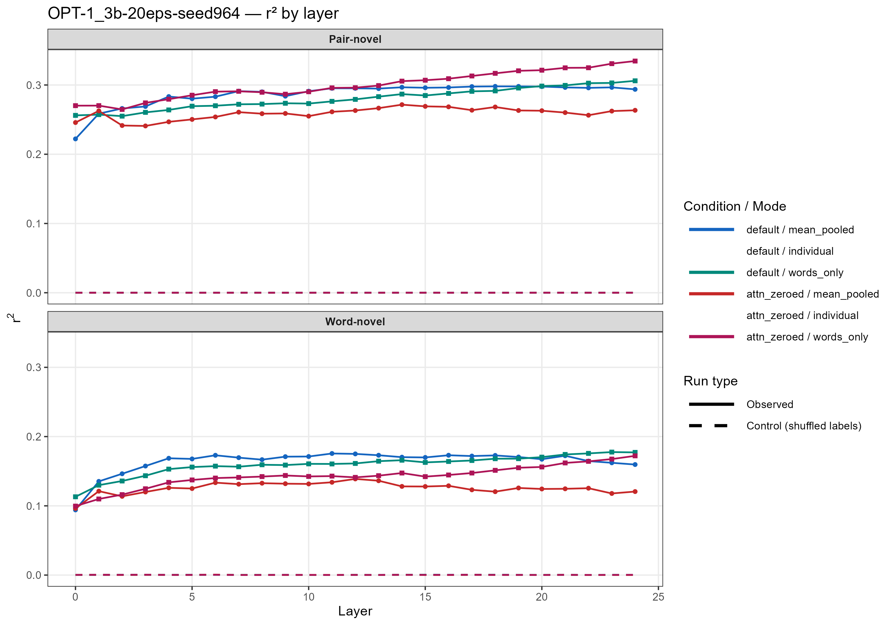

### pair_novel r² by layer

| Layer | default / mean_pooled | default / individual | default / words_only | attn_zeroed / mean_pooled | attn_zeroed / individual | attn_zeroed / words_only |
|---:|---:|---:|---:|---:|---:|---:|
| 0  | .251 | .238 | .268 | .285 | .259 | .284 |
| 1  | .288 | .231 | .274 | .306 | .257 | .293 |
| 2  | .297 | .238 | .278 | .302 | .261 | .295 |
| 3  | .300 | .242 | .279 | .308 | .267 | .302 |
| 4  | .306 | .248 | .285 | .309 | .277 | .310 |
| 5  | .309 | .251 | .288 | .313 | .281 | .312 |
| 6  | .310 | .252 | .290 | .316 | .281 | .317 |
| 7  | .310 | .251 | .291 | .316 | .281 | .316 |
| 8  | .311 | .253 | .292 | .316 | .282 | .315 |
| 9  | .312 | .252 | .290 | .315 | .282 | .315 |
| 10 | .313 | .251 | .292 | .317 | .284 | .317 |
| 11 | .315 | .254 | .294 | .321 | .285 | .320 |
| 12 | .315 | .252 | .296 | .320 | .287 | .319 |
| 13 | .314 | .253 | .297 | .319 | .288 | .321 |
| 14 | .315 | .254 | .298 | .318 | .290 | .324 |
| 15 | .313 | .255 | .298 | .319 | .289 | .324 |
| 16 | .314 | .256 | .301 | .316 | .290 | .326 |
| 17 | .314 | .254 | .302 | .317 | .291 | .328 |
| 18 | .312 | .256 | .304 | .315 | .293 | .329 |
| 19 | .312 | .256 | .306 | .313 | .294 | .333 |
| 20 | .311 | .257 | .309 | .311 | .294 | .337 |
| 21 | .312 | .259 | .311 | .309 | .295 | .339 |
| 22 | .310 | .255 | .311 | .307 | .296 | .342 |
| 23 | .307 | .255 | .315 | .305 | .297 | .342 |
| 24 | .304 | .251 | .316 | .303 | .298 | .346 |

### word_novel r² by layer

| Layer | default / mean_pooled | default / individual | default / words_only | attn_zeroed / mean_pooled | attn_zeroed / individual | attn_zeroed / words_only |
|---:|---:|---:|---:|---:|---:|---:|
| 0  | .096 | .095 | .110 | .097 | .090 | .097 |
| 1  | .143 | .108 | .133 | .127 | .097 | .119 |
| 2  | .147 | .114 | .134 | .130 | .103 | .123 |
| 3  | .161 | .122 | .144 | .140 | .112 | .132 |
| 4  | .166 | .130 | .156 | .147 | .119 | .142 |
| 5  | .173 | .128 | .157 | .149 | .126 | .147 |
| 6  | .173 | .133 | .157 | .155 | .124 | .145 |
| 7  | .172 | .131 | .161 | .152 | .126 | .143 |
| 8  | .171 | .128 | .158 | .150 | .124 | .145 |
| 9  | .175 | .131 | .161 | .151 | .124 | .144 |
| 10 | .176 | .131 | .160 | .154 | .125 | .144 |
| 11 | .180 | .132 | .159 | .153 | .126 | .145 |
| 12 | .176 | .132 | .164 | .154 | .126 | .144 |
| 13 | .177 | .134 | .163 | .152 | .129 | .146 |
| 14 | .174 | .137 | .166 | .149 | .130 | .150 |
| 15 | .174 | .135 | .164 | .146 | .129 | .145 |
| 16 | .173 | .135 | .164 | .144 | .131 | .145 |
| 17 | .176 | .131 | .163 | .142 | .130 | .152 |
| 18 | .171 | .134 | .167 | .145 | .132 | .155 |
| 19 | .170 | .130 | .167 | .145 | .133 | .161 |
| 20 | .166 | .131 | .172 | .140 | .133 | .164 |
| 21 | .171 | .132 | .178 | .135 | .129 | .165 |
| 22 | .166 | .128 | .175 | .139 | .133 | .167 |
| 23 | .166 | .134 | .175 | .133 | .137 | .169 |
| 24 | .161 | .128 | .180 | .130 | .139 | .174 |

**Key observations (1.3B):**
- The late-layer acceleration seen in 350M is absent here. Default pair_novel mean_pooled plateaus around .310–.315 from layers 5–22, then slightly declines.
- `words_only` is the only mode that increases monotonically through all 24 layers in both conditions — attn_zeroed/words_only reaches .346 at layer 24 (the overall peak), default/words_only reaches .316.
- attn_zeroed starts above default at layer 0 for most modes, but the gap narrows by the final layers as words_only keeps climbing in both conditions.
- word_novel peaks around layers 11–13 for default (mean_pooled .176–.180) and is largely flat from layer 5 onward for attn_zeroed, with words_only climbing gradually to .174 at layer 24.
- Layer 0 starts lower than 125M or 350M across all modes, suggesting less representational structure in the embedding layer of this larger model.

### Observed vs. predicted — pair-novel split (key layers)

**Default condition:**
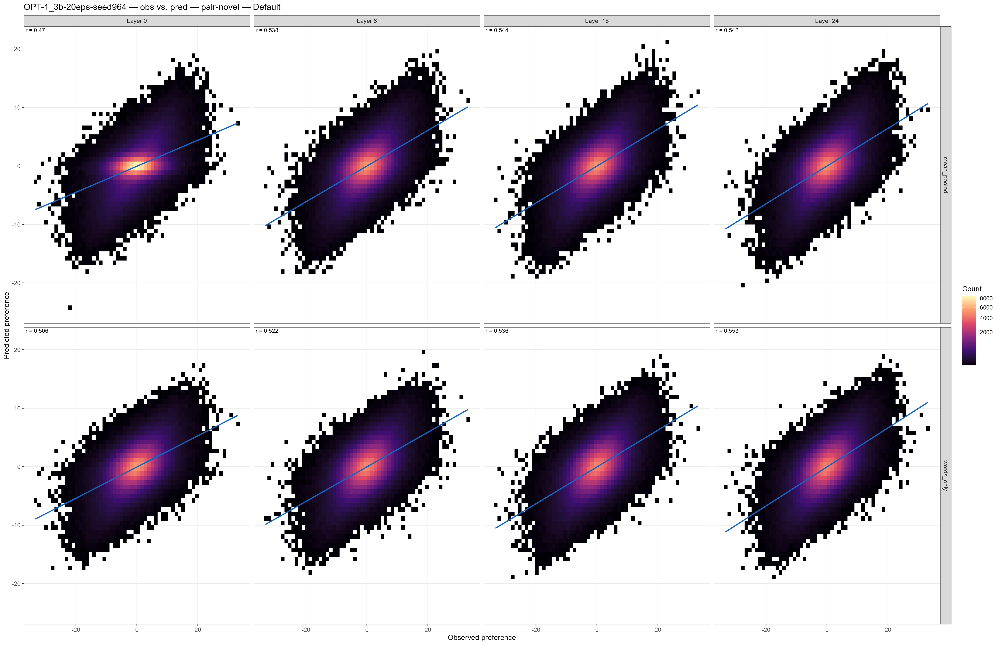

**Attention-zeroed condition:**
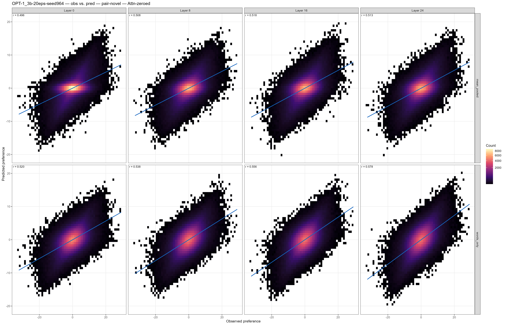

### Observed vs. predicted — word-novel split (key layers)

**Default condition:**
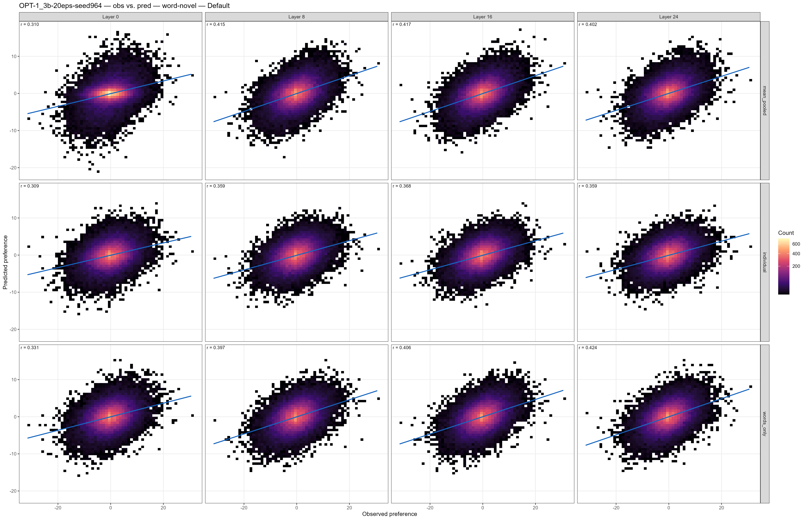

**Attention-zeroed condition:**
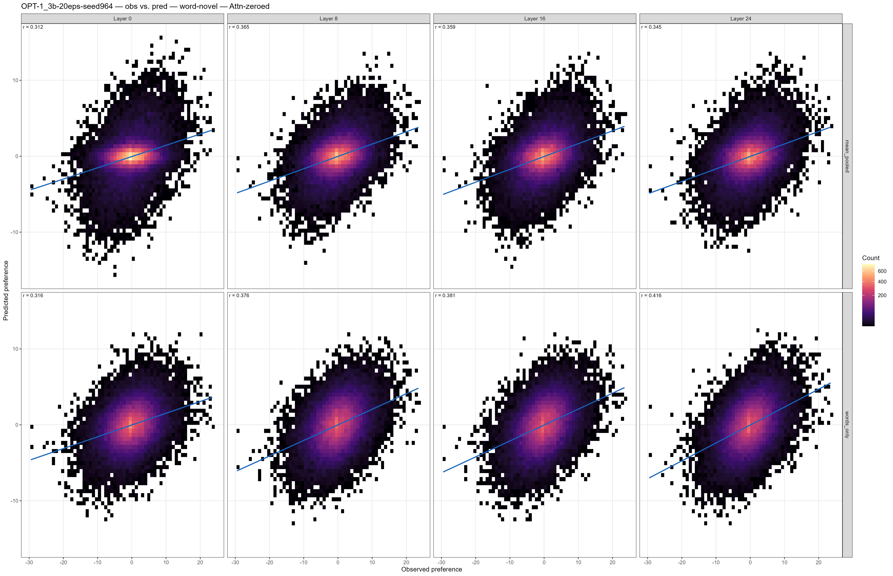

### Corpus-frequency analysis

MLP trained on all novel pairs (~340k), tested on corpus pairs (~49k). For each condition × layer × mode, `lm(|residual| ~ log(freq))` was fit where `|residual| = |y_true − y_pred|` and `freq = freq_w1_w2 + freq_w2_w1` from corpus. A negative β means higher-frequency pairs have lower absolute error (model is more accurate for them); a positive β means higher-frequency pairs have larger errors.

#### default condition

##### mean_pooled

| Layer | β | 95% CI | p |
|---:|---:|---|---|
| 0  | +0.036 | [−0.006, +0.078] | .090 |
| 1  | +0.072 | [+0.031, +0.113] | <.001 *** |
| 2  | +0.046 | [+0.006, +0.087] | .025 * |
| 3  | +0.043 | [+0.002, +0.084] | .039 * |
| 4  | +0.041 | [+0.000, +0.081] | .049 * |
| 5  | +0.032 | [−0.008, +0.073] | .118 |
| 6  | +0.040 | [−0.001, +0.080] | .054 |
| 7  | +0.036 | [−0.004, +0.077] | .078 |
| 8  | +0.045 | [+0.005, +0.085] | .028 * |
| 9  | +0.044 | [+0.004, +0.084] | .031 * |
| 10 | +0.039 | [−0.001, +0.079] | .056 |
| 11 | +0.032 | [−0.008, +0.072] | .119 |
| 12 | +0.060 | [+0.020, +0.101] | .003 ** |
| 13 | +0.034 | [−0.006, +0.074] | .095 |
| 14 | +0.049 | [+0.008, +0.089] | .018 * |
| 15 | +0.031 | [−0.008, +0.071] | .120 |
| 16 | +0.039 | [−0.001, +0.079] | .054 |
| 17 | +0.059 | [+0.019, +0.098] | .004 ** |
| 18 | +0.057 | [+0.017, +0.097] | .006 ** |
| 19 | +0.063 | [+0.023, +0.104] | .002 ** |
| 20 | +0.050 | [+0.010, +0.091] | .015 * |
| 21 | +0.044 | [+0.004, +0.084] | .032 * |
| 22 | +0.037 | [−0.003, +0.078] | .071 |
| 23 | +0.040 | [+0.000, +0.080] | .050 |
| 24 | +0.034 | [−0.006, +0.074] | .095 |

##### individual

| Layer | β | 95% CI | p |
|---:|---:|---|---|
| 0  | +0.027 | [−0.014, +0.068] | .195 |
| 1  | +0.026 | [−0.015, +0.067] | .217 |
| 2  | +0.027 | [−0.014, +0.067] | .205 |
| 3  | +0.032 | [−0.008, +0.073] | .119 |
| 4  | +0.045 | [+0.004, +0.086] | .031 * |
| 5  | +0.015 | [−0.026, +0.056] | .473 |
| 6  | +0.023 | [−0.018, +0.064] | .265 |
| 7  | +0.022 | [−0.019, +0.062] | .289 |
| 8  | +0.020 | [−0.021, +0.061] | .333 |
| 9  | +0.033 | [−0.007, +0.074] | .108 |
| 10 | +0.033 | [−0.008, +0.074] | .111 |
| 11 | +0.029 | [−0.012, +0.069] | .164 |
| 12 | +0.004 | [−0.037, +0.044] | .858 |
| 13 | +0.029 | [−0.011, +0.070] | .159 |
| 14 | +0.018 | [−0.022, +0.059] | .376 |
| 15 | +0.024 | [−0.016, +0.064] | .245 |
| 16 | +0.006 | [−0.035, +0.046] | .778 |
| 17 |  0.000 | [−0.040, +0.041] | .992 |
| 18 | +0.008 | [−0.033, +0.048] | .711 |
| 19 | −0.005 | [−0.045, +0.036] | .821 |
| 20 | +0.009 | [−0.031, +0.049] | .659 |
| 21 | +0.013 | [−0.028, +0.053] | .537 |
| 22 | +0.018 | [−0.022, +0.059] | .381 |
| 23 | +0.002 | [−0.038, +0.043] | .917 |
| 24 | +0.014 | [−0.027, +0.054] | .504 |

##### words_only

| Layer | β | 95% CI | p |
|---:|---:|---|---|
| 0  | +0.041 | [+0.001, +0.082] | .047 * |
| 1  | +0.020 | [−0.020, +0.061] | .327 |
| 2  | +0.016 | [−0.025, +0.057] | .441 |
| 3  | +0.033 | [−0.007, +0.074] | .108 |
| 4  | +0.026 | [−0.014, +0.067] | .200 |
| 5  | +0.033 | [−0.008, +0.073] | .112 |
| 6  | +0.014 | [−0.026, +0.055] | .491 |
| 7  | +0.036 | [−0.005, +0.076] | .082 |
| 8  | +0.030 | [−0.010, +0.070] | .145 |
| 9  | +0.036 | [−0.005, +0.076] | .084 |
| 10 | +0.037 | [−0.003, +0.078] | .069 |
| 11 | +0.028 | [−0.013, +0.068] | .178 |
| 12 | +0.027 | [−0.013, +0.066] | .191 |
| 13 | +0.027 | [−0.013, +0.067] | .184 |
| 14 | +0.039 | [−0.001, +0.079] | .056 |
| 15 | +0.027 | [−0.012, +0.067] | .175 |
| 16 | +0.030 | [−0.010, +0.070] | .142 |
| 17 | +0.027 | [−0.013, +0.067] | .179 |
| 18 | +0.015 | [−0.025, +0.054] | .472 |
| 19 | +0.014 | [−0.025, +0.053] | .479 |
| 20 | +0.005 | [−0.034, +0.044] | .794 |
| 21 | +0.016 | [−0.024, +0.055] | .430 |
| 22 | +0.002 | [−0.037, +0.041] | .917 |
| 23 | +0.017 | [−0.022, +0.056] | .393 |
| 24 | +0.006 | [−0.033, +0.045] | .762 |

#### attn_zeroed condition

##### mean_pooled

| Layer | β | 95% CI | p |
|---:|---:|---|---|
| 0  | −0.159 | [−0.198, −0.121] | <.001 *** |
| 1  | −0.137 | [−0.174, −0.099] | <.001 *** |
| 2  | −0.121 | [−0.159, −0.084] | <.001 *** |
| 3  | −0.116 | [−0.153, −0.079] | <.001 *** |
| 4  | −0.132 | [−0.169, −0.095] | <.001 *** |
| 5  | −0.117 | [−0.154, −0.080] | <.001 *** |
| 6  | −0.116 | [−0.153, −0.078] | <.001 *** |
| 7  | −0.127 | [−0.164, −0.090] | <.001 *** |
| 8  | −0.134 | [−0.171, −0.097] | <.001 *** |
| 9  | −0.121 | [−0.157, −0.084] | <.001 *** |
| 10 | −0.136 | [−0.173, −0.099] | <.001 *** |
| 11 | −0.120 | [−0.157, −0.084] | <.001 *** |
| 12 | −0.127 | [−0.164, −0.091] | <.001 *** |
| 13 | −0.131 | [−0.168, −0.094] | <.001 *** |
| 14 | −0.138 | [−0.174, −0.101] | <.001 *** |
| 15 | −0.132 | [−0.169, −0.096] | <.001 *** |
| 16 | −0.110 | [−0.147, −0.074] | <.001 *** |
| 17 | −0.127 | [−0.164, −0.090] | <.001 *** |
| 18 | −0.132 | [−0.169, −0.095] | <.001 *** |
| 19 | −0.111 | [−0.148, −0.074] | <.001 *** |
| 20 | −0.122 | [−0.160, −0.085] | <.001 *** |
| 21 | −0.128 | [−0.165, −0.092] | <.001 *** |
| 22 | −0.118 | [−0.156, −0.081] | <.001 *** |
| 23 | −0.150 | [−0.187, −0.113] | <.001 *** |
| 24 | −0.145 | [−0.183, −0.107] | <.001 *** |

##### individual

| Layer | β | 95% CI | p |
|---:|---:|---|---|
| 0  | −0.132 | [−0.169, −0.094] | <.001 *** |
| 1  | −0.142 | [−0.179, −0.104] | <.001 *** |
| 2  | −0.137 | [−0.174, −0.100] | <.001 *** |
| 3  | −0.125 | [−0.163, −0.088] | <.001 *** |
| 4  | −0.155 | [−0.191, −0.118] | <.001 *** |
| 5  | −0.112 | [−0.149, −0.076] | <.001 *** |
| 6  | −0.125 | [−0.162, −0.088] | <.001 *** |
| 7  | −0.122 | [−0.159, −0.086] | <.001 *** |
| 8  | −0.129 | [−0.165, −0.092] | <.001 *** |
| 9  | −0.121 | [−0.158, −0.084] | <.001 *** |
| 10 | −0.142 | [−0.179, −0.106] | <.001 *** |
| 11 | −0.125 | [−0.162, −0.089] | <.001 *** |
| 12 | −0.144 | [−0.181, −0.108] | <.001 *** |
| 13 | −0.135 | [−0.171, −0.099] | <.001 *** |
| 14 | −0.132 | [−0.168, −0.096] | <.001 *** |
| 15 | −0.133 | [−0.169, −0.097] | <.001 *** |
| 16 | −0.145 | [−0.181, −0.109] | <.001 *** |
| 17 | −0.133 | [−0.169, −0.097] | <.001 *** |
| 18 | −0.147 | [−0.183, −0.111] | <.001 *** |
| 19 | −0.155 | [−0.191, −0.119] | <.001 *** |
| 20 | −0.132 | [−0.168, −0.096] | <.001 *** |
| 21 | −0.129 | [−0.166, −0.093] | <.001 *** |
| 22 | −0.150 | [−0.186, −0.115] | <.001 *** |
| 23 | −0.147 | [−0.182, −0.111] | <.001 *** |
| 24 | −0.142 | [−0.177, −0.106] | <.001 *** |

##### words_only

| Layer | β | 95% CI | p |
|---:|---:|---|---|
| 0  | −0.131 | [−0.169, −0.093] | <.001 *** |
| 1  | −0.145 | [−0.183, −0.107] | <.001 *** |
| 2  | −0.118 | [−0.156, −0.080] | <.001 *** |
| 3  | −0.126 | [−0.164, −0.089] | <.001 *** |
| 4  | −0.150 | [−0.186, −0.113] | <.001 *** |
| 5  | −0.128 | [−0.165, −0.092] | <.001 *** |
| 6  | −0.159 | [−0.196, −0.123] | <.001 *** |
| 7  | −0.132 | [−0.170, −0.095] | <.001 *** |
| 8  | −0.123 | [−0.159, −0.087] | <.001 *** |
| 9  | −0.148 | [−0.184, −0.112] | <.001 *** |
| 10 | −0.159 | [−0.195, −0.122] | <.001 *** |
| 11 | −0.125 | [−0.162, −0.089] | <.001 *** |
| 12 | −0.150 | [−0.186, −0.114] | <.001 *** |
| 13 | −0.134 | [−0.170, −0.098] | <.001 *** |
| 14 | −0.124 | [−0.160, −0.087] | <.001 *** |
| 15 | −0.118 | [−0.155, −0.082] | <.001 *** |
| 16 | −0.120 | [−0.156, −0.084] | <.001 *** |
| 17 | −0.131 | [−0.167, −0.094] | <.001 *** |
| 18 | −0.156 | [−0.191, −0.120] | <.001 *** |
| 19 | −0.148 | [−0.183, −0.112] | <.001 *** |
| 20 | −0.135 | [−0.170, −0.099] | <.001 *** |
| 21 | −0.154 | [−0.189, −0.119] | <.001 *** |
| 22 | −0.165 | [−0.201, −0.130] | <.001 *** |
| 23 | −0.169 | [−0.204, −0.134] | <.001 *** |
| 24 | −0.165 | [−0.200, −0.130] | <.001 *** |

**Overall pattern (1.3B):** The same dissociation as 125M and 350M, but with notably larger effect sizes in the attn_zeroed conditions (β ≈ −0.11 to −0.16 vs. −0.05 to −0.10 for the smaller models), suggesting the larger model's representations are more frequency-sensitive at the word level. All three attn_zeroed modes show highly significant negative β across all 25 layers. Default/mean_pooled shows positive β at most layers, significant at layers 1–4, 8–9, 12, 14, 17–21 — weaker and patchier than in 350M, where it was significant at every layer. Default/individual and default/words_only are effectively null throughout.

---

## Frequency strata PLS (old approach)

PLS trained on corpus pairs within each frequency bin, tested on novel pairs. All r² ≈ 0.001–0.013 across all layers, models, and strata — no meaningful frequency gradient. Superseded by the novel→corpus direction above.

---

## Corpus-frequency regression — consolidated

Self-contained reproduction of all corpus-frequency results across all three models. MLP trained on novel pairs (~340k), tested on corpus pairs (~49k). Outcome variable is `|residual| = |y_true − y_pred|` regressed on `log(freq_w1_w2 + freq_w2_w1)`. A negative β means the model is more accurate for higher-frequency pairs; positive β means less accurate.

**Key finding:** A consistent dissociation across all three models and all layers — the attn_zeroed condition always shows negative β (more accurate for high-freq) while the default/mean_pooled condition shows positive β (less accurate for high-freq). Default/individual and default/words_only are near zero throughout.

### Plots

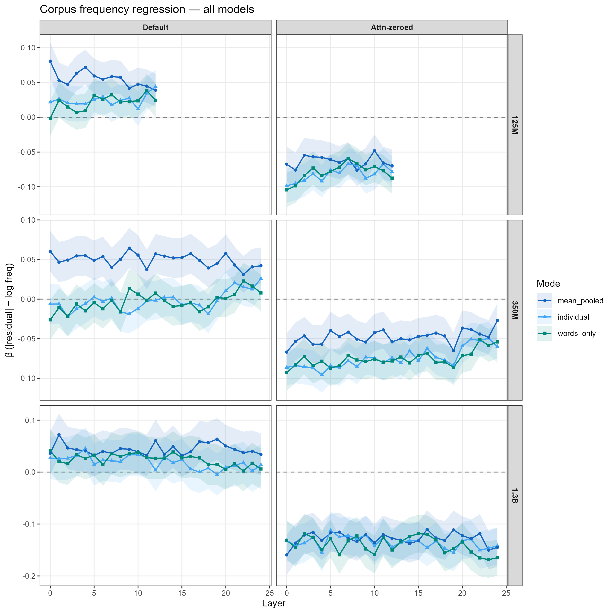

**OPT-125M:**
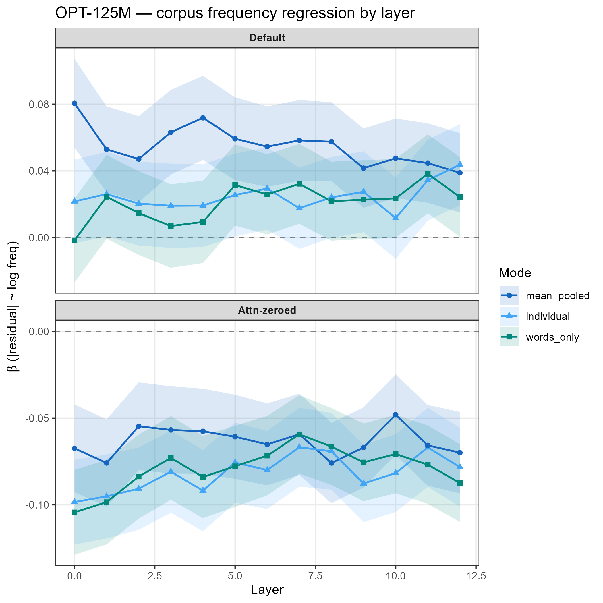

**OPT-350M:**
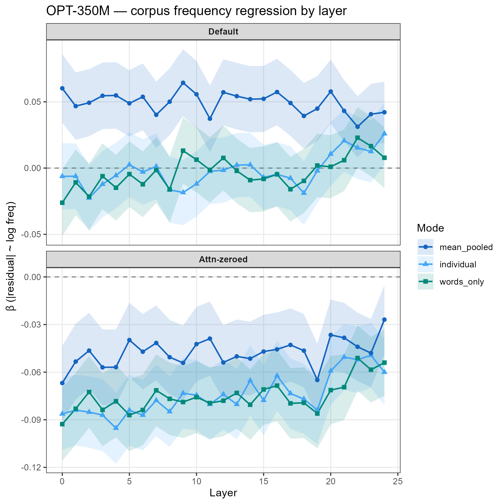

**OPT-1.3B:**
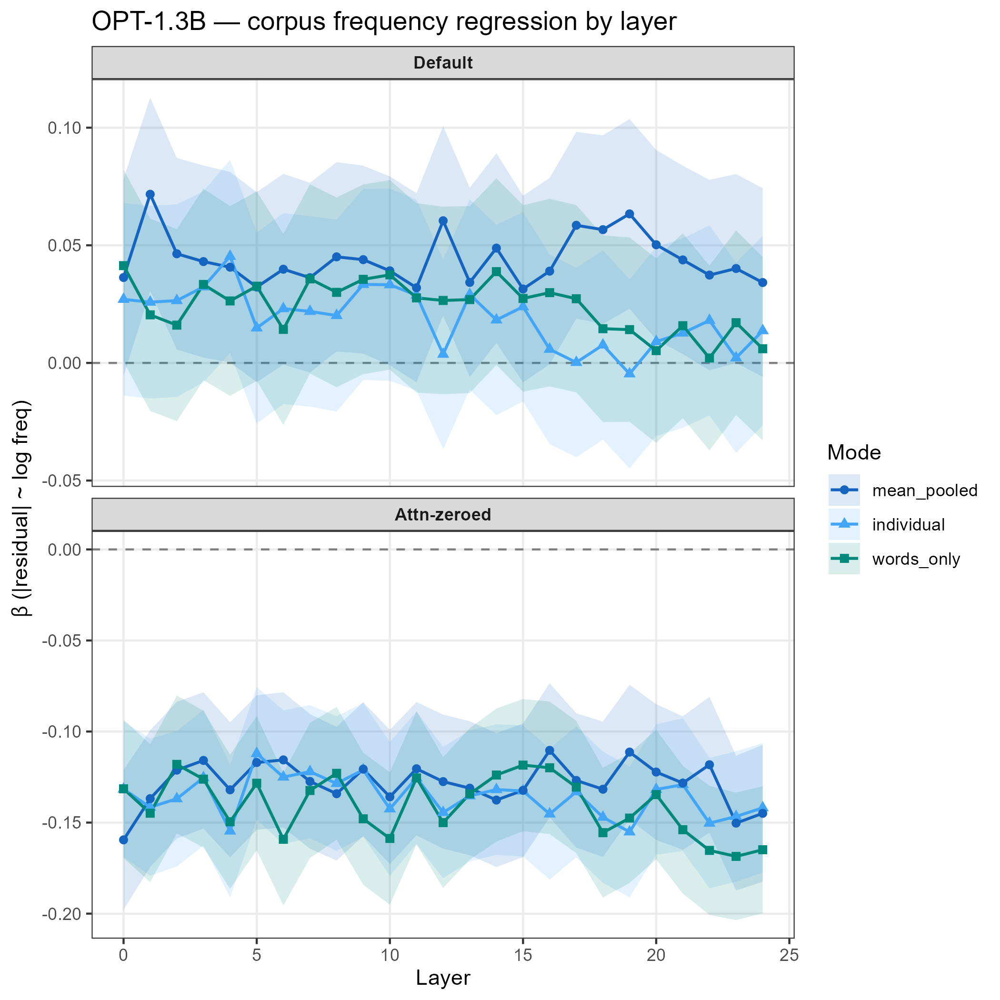

---

### OPT-125M (layers 0–12)

#### default / mean_pooled

| Layer | β | 95% CI | p |
|---:|---:|---|---|
| 0  | +0.081 | [+0.054, +0.107] | <.001 *** |
| 1  | +0.053 | [+0.027, +0.079] | <.001 *** |
| 2  | +0.047 | [+0.021, +0.073] | <.001 *** |
| 3  | +0.063 | [+0.038, +0.089] | <.001 *** |
| 4  | +0.072 | [+0.047, +0.097] | <.001 *** |
| 5  | +0.059 | [+0.034, +0.084] | <.001 *** |
| 6  | +0.055 | [+0.031, +0.079] | <.001 *** |
| 7  | +0.058 | [+0.034, +0.083] | <.001 *** |
| 8  | +0.058 | [+0.034, +0.081] | <.001 *** |
| 9  | +0.042 | [+0.018, +0.065] | <.001 *** |
| 10 | +0.048 | [+0.024, +0.071] | <.001 *** |
| 11 | +0.045 | [+0.021, +0.069] | <.001 *** |
| 12 | +0.039 | [+0.015, +0.063] | .001 ** |

#### default / individual

| Layer | β | 95% CI | p |
|---:|---:|---|---|
| 0  | +0.022 | [−0.003, +0.047] | .090 |
| 1  | +0.026 | [+0.001, +0.052] | .043 * |
| 2  | +0.020 | [−0.005, +0.046] | .112 |
| 3  | +0.019 | [−0.006, +0.044] | .138 |
| 4  | +0.019 | [−0.006, +0.044] | .130 |
| 5  | +0.026 | [+0.001, +0.050] | .043 * |
| 6  | +0.030 | [+0.005, +0.054] | .019 * |
| 7  | +0.018 | [−0.007, +0.042] | .156 |
| 8  | +0.024 | [−0.000, +0.048] | .051 |
| 9  | +0.028 | [+0.003, +0.052] | .026 * |
| 10 | +0.012 | [−0.013, +0.036] | .346 |
| 11 | +0.035 | [+0.010, +0.059] | .005 ** |
| 12 | +0.044 | [+0.020, +0.068] | <.001 *** |

#### default / words_only

| Layer | β | 95% CI | p |
|---:|---:|---|---|
| 0  |  0.000 | [−0.027, +0.024] | .898 |
| 1  | +0.025 | [−0.001, +0.050] | .056 |
| 2  | +0.015 | [−0.010, +0.040] | .250 |
| 3  | +0.007 | [−0.018, +0.032] | .584 |
| 4  | +0.009 | [−0.015, +0.034] | .454 |
| 5  | +0.032 | [+0.007, +0.056] | .011 * |
| 6  | +0.026 | [+0.002, +0.050] | .035 * |
| 7  | +0.032 | [+0.008, +0.056] | .008 ** |
| 8  | +0.022 | [−0.002, +0.046] | .070 |
| 9  | +0.023 | [−0.001, +0.046] | .060 |
| 10 | +0.024 | [−0.000, +0.047] | .050 |
| 11 | +0.038 | [+0.015, +0.062] | .002 ** |
| 12 | +0.024 | [+0.000, +0.048] | .046 * |

#### attn_zeroed / mean_pooled

| Layer | β | 95% CI | p |
|---:|---:|---|---|
| 0  | −0.068 | [−0.093, −0.042] | <.001 *** |
| 1  | −0.076 | [−0.101, −0.051] | <.001 *** |
| 2  | −0.055 | [−0.080, −0.029] | <.001 *** |
| 3  | −0.057 | [−0.082, −0.032] | <.001 *** |
| 4  | −0.058 | [−0.082, −0.033] | <.001 *** |
| 5  | −0.061 | [−0.085, −0.037] | <.001 *** |
| 6  | −0.065 | [−0.089, −0.042] | <.001 *** |
| 7  | −0.059 | [−0.083, −0.036] | <.001 *** |
| 8  | −0.076 | [−0.099, −0.053] | <.001 *** |
| 9  | −0.067 | [−0.090, −0.044] | <.001 *** |
| 10 | −0.048 | [−0.071, −0.025] | <.001 *** |
| 11 | −0.066 | [−0.089, −0.043] | <.001 *** |
| 12 | −0.070 | [−0.093, −0.047] | <.001 *** |

#### attn_zeroed / individual

| Layer | β | 95% CI | p |
|---:|---:|---|---|
| 0  | −0.098 | [−0.123, −0.074] | <.001 *** |
| 1  | −0.095 | [−0.119, −0.071] | <.001 *** |
| 2  | −0.091 | [−0.114, −0.067] | <.001 *** |
| 3  | −0.081 | [−0.105, −0.057] | <.001 *** |
| 4  | −0.092 | [−0.115, −0.068] | <.001 *** |
| 5  | −0.076 | [−0.099, −0.053] | <.001 *** |
| 6  | −0.080 | [−0.102, −0.058] | <.001 *** |
| 7  | −0.067 | [−0.090, −0.044] | <.001 *** |
| 8  | −0.069 | [−0.091, −0.047] | <.001 *** |
| 9  | −0.088 | [−0.110, −0.065] | <.001 *** |
| 10 | −0.082 | [−0.104, −0.059] | <.001 *** |
| 11 | −0.067 | [−0.090, −0.044] | <.001 *** |
| 12 | −0.078 | [−0.101, −0.056] | <.001 *** |

#### attn_zeroed / words_only

| Layer | β | 95% CI | p |
|---:|---:|---|---|
| 0  | −0.104 | [−0.129, −0.080] | <.001 *** |
| 1  | −0.099 | [−0.123, −0.074] | <.001 *** |
| 2  | −0.084 | [−0.108, −0.060] | <.001 *** |
| 3  | −0.073 | [−0.097, −0.049] | <.001 *** |
| 4  | −0.084 | [−0.108, −0.060] | <.001 *** |
| 5  | −0.078 | [−0.101, −0.054] | <.001 *** |
| 6  | −0.072 | [−0.095, −0.049] | <.001 *** |
| 7  | −0.059 | [−0.082, −0.037] | <.001 *** |
| 8  | −0.066 | [−0.089, −0.044] | <.001 *** |
| 9  | −0.076 | [−0.098, −0.053] | <.001 *** |
| 10 | −0.071 | [−0.093, −0.048] | <.001 *** |
| 11 | −0.077 | [−0.100, −0.054] | <.001 *** |
| 12 | −0.087 | [−0.110, −0.065] | <.001 *** |

---

### OPT-350M (layers 0–24)

#### default / mean_pooled

| Layer | β | 95% CI | p |
|---:|---:|---|---|
| 0  | +0.060 | [+0.034, +0.086] | <.001 *** |
| 1  | +0.047 | [+0.021, +0.072] | <.001 *** |
| 2  | +0.049 | [+0.024, +0.075] | <.001 *** |
| 3  | +0.055 | [+0.029, +0.080] | <.001 *** |
| 4  | +0.055 | [+0.030, +0.080] | <.001 *** |
| 5  | +0.049 | [+0.024, +0.074] | <.001 *** |
| 6  | +0.054 | [+0.029, +0.079] | <.001 *** |
| 7  | +0.040 | [+0.015, +0.065] | .002 ** |
| 8  | +0.050 | [+0.025, +0.075] | <.001 *** |
| 9  | +0.064 | [+0.039, +0.090] | <.001 *** |
| 10 | +0.056 | [+0.031, +0.081] | <.001 *** |
| 11 | +0.037 | [+0.012, +0.062] | .004 ** |
| 12 | +0.057 | [+0.032, +0.082] | <.001 *** |
| 13 | +0.054 | [+0.029, +0.079] | <.001 *** |
| 14 | +0.052 | [+0.027, +0.077] | <.001 *** |
| 15 | +0.052 | [+0.027, +0.077] | <.001 *** |
| 16 | +0.057 | [+0.032, +0.083] | <.001 *** |
| 17 | +0.049 | [+0.024, +0.074] | <.001 *** |
| 18 | +0.039 | [+0.015, +0.064] | .002 ** |
| 19 | +0.045 | [+0.020, +0.069] | <.001 *** |
| 20 | +0.058 | [+0.034, +0.082] | <.001 *** |
| 21 | +0.043 | [+0.020, +0.066] | <.001 *** |
| 22 | +0.031 | [+0.008, +0.054] | .008 ** |
| 23 | +0.041 | [+0.018, +0.064] | <.001 *** |
| 24 | +0.042 | [+0.019, +0.065] | <.001 *** |

#### default / individual

| Layer | β | 95% CI | p |
|---:|---:|---|---|
| 0  | −0.006 | [−0.031, +0.019] | .626 |
| 1  | −0.006 | [−0.031, +0.019] | .627 |
| 2  | −0.023 | [−0.048, +0.002] | .075 |
| 3  | −0.012 | [−0.037, +0.013] | .343 |
| 4  | −0.006 | [−0.030, +0.019] | .657 |
| 5  | +0.003 | [−0.022, +0.027] | .838 |
| 6  | −0.003 | [−0.028, +0.022] | .817 |
| 7  | +0.001 | [−0.024, +0.026] | .921 |
| 8  | −0.016 | [−0.041, +0.008] | .196 |
| 9  | −0.018 | [−0.043, +0.006] | .142 |
| 10 | −0.012 | [−0.037, +0.013] | .343 |
| 11 | −0.002 | [−0.027, +0.022] | .844 |
| 12 | −0.002 | [−0.026, +0.023] | .899 |
| 13 | +0.002 | [−0.022, +0.027] | .857 |
| 14 | +0.002 | [−0.022, +0.027] | .840 |
| 15 | −0.007 | [−0.032, +0.018] | .574 |
| 16 | −0.005 | [−0.029, +0.019] | .702 |
| 17 | −0.008 | [−0.032, +0.017] | .535 |
| 18 | −0.019 | [−0.043, +0.005] | .125 |
| 19 | −0.002 | [−0.026, +0.022] | .868 |
| 20 | +0.011 | [−0.013, +0.035] | .387 |
| 21 | +0.021 | [−0.003, +0.044] | .085 |
| 22 | +0.015 | [−0.008, +0.039] | .203 |
| 23 | +0.013 | [−0.011, +0.036] | .291 |
| 24 | +0.026 | [+0.002, +0.049] | .030 * |

#### default / words_only

| Layer | β | 95% CI | p |
|---:|---:|---|---|
| 0  | −0.026 | [−0.051, −0.001] | .042 * |
| 1  | −0.011 | [−0.036, +0.014] | .391 |
| 2  | −0.022 | [−0.047, +0.004] | .092 |
| 3  | −0.006 | [−0.031, +0.019] | .629 |
| 4  | −0.015 | [−0.040, +0.010] | .242 |
| 5  | −0.005 | [−0.029, +0.020] | .717 |
| 6  | −0.012 | [−0.037, +0.013] | .336 |
| 7  | −0.002 | [−0.026, +0.023] | .905 |
| 8  | −0.016 | [−0.041, +0.009] | .206 |
| 9  | +0.013 | [−0.012, +0.038] | .302 |
| 10 | +0.006 | [−0.018, +0.031] | .614 |
| 11 | −0.001 | [−0.026, +0.023] | .912 |
| 12 | +0.008 | [−0.017, +0.032] | .541 |
| 13 | −0.002 | [−0.026, +0.022] | .868 |
| 14 | −0.009 | [−0.033, +0.015] | .464 |
| 15 | −0.008 | [−0.033, +0.016] | .514 |
| 16 | −0.005 | [−0.029, +0.020] | .703 |
| 17 | −0.016 | [−0.040, +0.008] | .200 |
| 18 | −0.010 | [−0.034, +0.015] | .433 |
| 19 | +0.002 | [−0.022, +0.026] | .875 |
| 20 | +0.001 | [−0.023, +0.025] | .934 |
| 21 | +0.006 | [−0.017, +0.029] | .615 |
| 22 | +0.023 | [+0.000, +0.046] | .049 * |
| 23 | +0.017 | [−0.006, +0.039] | .153 |
| 24 | +0.008 | [−0.015, +0.031] | .505 |

#### attn_zeroed / mean_pooled

| Layer | β | 95% CI | p |
|---:|---:|---|---|
| 0  | −0.067 | [−0.090, −0.043] | <.001 *** |
| 1  | −0.053 | [−0.077, −0.029] | <.001 *** |
| 2  | −0.046 | [−0.070, −0.023] | <.001 *** |
| 3  | −0.057 | [−0.081, −0.033] | <.001 *** |
| 4  | −0.057 | [−0.081, −0.033] | <.001 *** |
| 5  | −0.040 | [−0.063, −0.016] | <.001 *** |
| 6  | −0.047 | [−0.071, −0.023] | <.001 *** |
| 7  | −0.042 | [−0.065, −0.018] | <.001 *** |
| 8  | −0.051 | [−0.074, −0.027] | <.001 *** |
| 9  | −0.054 | [−0.078, −0.031] | <.001 *** |
| 10 | −0.042 | [−0.066, −0.019] | <.001 *** |
| 11 | −0.039 | [−0.062, −0.016] | .001 ** |
| 12 | −0.054 | [−0.077, −0.031] | <.001 *** |
| 13 | −0.050 | [−0.073, −0.027] | <.001 *** |
| 14 | −0.052 | [−0.075, −0.028] | <.001 *** |
| 15 | −0.047 | [−0.070, −0.024] | <.001 *** |
| 16 | −0.046 | [−0.069, −0.022] | <.001 *** |
| 17 | −0.043 | [−0.066, −0.020] | <.001 *** |
| 18 | −0.047 | [−0.070, −0.023] | <.001 *** |
| 19 | −0.065 | [−0.088, −0.042] | <.001 *** |
| 20 | −0.037 | [−0.059, −0.014] | .001 ** |
| 21 | −0.038 | [−0.060, −0.016] | <.001 *** |
| 22 | −0.044 | [−0.066, −0.023] | <.001 *** |
| 23 | −0.048 | [−0.070, −0.026] | <.001 *** |
| 24 | −0.027 | [−0.049, −0.005] | .015 * |

#### attn_zeroed / individual

| Layer | β | 95% CI | p |
|---:|---:|---|---|
| 0  | −0.086 | [−0.109, −0.064] | <.001 *** |
| 1  | −0.084 | [−0.106, −0.062] | <.001 *** |
| 2  | −0.085 | [−0.108, −0.063] | <.001 *** |
| 3  | −0.087 | [−0.110, −0.064] | <.001 *** |
| 4  | −0.095 | [−0.118, −0.073] | <.001 *** |
| 5  | −0.084 | [−0.106, −0.062] | <.001 *** |
| 6  | −0.087 | [−0.109, −0.065] | <.001 *** |
| 7  | −0.078 | [−0.100, −0.055] | <.001 *** |
| 8  | −0.085 | [−0.107, −0.063] | <.001 *** |
| 9  | −0.073 | [−0.096, −0.051] | <.001 *** |
| 10 | −0.075 | [−0.097, −0.052] | <.001 *** |
| 11 | −0.080 | [−0.103, −0.058] | <.001 *** |
| 12 | −0.074 | [−0.096, −0.052] | <.001 *** |
| 13 | −0.080 | [−0.102, −0.058] | <.001 *** |
| 14 | −0.065 | [−0.088, −0.043] | <.001 *** |
| 15 | −0.078 | [−0.100, −0.056] | <.001 *** |
| 16 | −0.062 | [−0.084, −0.040] | <.001 *** |
| 17 | −0.073 | [−0.096, −0.051] | <.001 *** |
| 18 | −0.077 | [−0.099, −0.055] | <.001 *** |
| 19 | −0.084 | [−0.105, −0.063] | <.001 *** |
| 20 | −0.059 | [−0.081, −0.038] | <.001 *** |
| 21 | −0.051 | [−0.071, −0.030] | <.001 *** |
| 22 | −0.052 | [−0.073, −0.031] | <.001 *** |
| 23 | −0.049 | [−0.070, −0.029] | <.001 *** |
| 24 | −0.060 | [−0.081, −0.039] | <.001 *** |

#### attn_zeroed / words_only

| Layer | β | 95% CI | p |
|---:|---:|---|---|
| 0  | −0.093 | [−0.116, −0.070] | <.001 *** |
| 1  | −0.083 | [−0.106, −0.061] | <.001 *** |
| 2  | −0.073 | [−0.095, −0.050] | <.001 *** |
| 3  | −0.084 | [−0.107, −0.061] | <.001 *** |
| 4  | −0.078 | [−0.101, −0.056] | <.001 *** |
| 5  | −0.087 | [−0.110, −0.064] | <.001 *** |
| 6  | −0.084 | [−0.106, −0.062] | <.001 *** |
| 7  | −0.072 | [−0.094, −0.049] | <.001 *** |
| 8  | −0.077 | [−0.100, −0.054] | <.001 *** |
| 9  | −0.079 | [−0.101, −0.056] | <.001 *** |
| 10 | −0.076 | [−0.099, −0.053] | <.001 *** |
| 11 | −0.080 | [−0.102, −0.057] | <.001 *** |
| 12 | −0.078 | [−0.100, −0.056] | <.001 *** |
| 13 | −0.073 | [−0.096, −0.051] | <.001 *** |
| 14 | −0.081 | [−0.103, −0.058] | <.001 *** |
| 15 | −0.071 | [−0.093, −0.049] | <.001 *** |
| 16 | −0.069 | [−0.091, −0.046] | <.001 *** |
| 17 | −0.080 | [−0.102, −0.057] | <.001 *** |
| 18 | −0.079 | [−0.102, −0.057] | <.001 *** |
| 19 | −0.086 | [−0.108, −0.064] | <.001 *** |
| 20 | −0.071 | [−0.093, −0.050] | <.001 *** |
| 21 | −0.070 | [−0.090, −0.049] | <.001 *** |
| 22 | −0.051 | [−0.072, −0.031] | <.001 *** |
| 23 | −0.059 | [−0.079, −0.038] | <.001 *** |
| 24 | −0.054 | [−0.075, −0.033] | <.001 *** |

---

### OPT-1.3B (layers 0–24)

#### default / mean_pooled

| Layer | β | 95% CI | p |
|---:|---:|---|---|
| 0  | +0.036 | [−0.006, +0.078] | .090 |
| 1  | +0.072 | [+0.031, +0.113] | <.001 *** |
| 2  | +0.046 | [+0.006, +0.087] | .025 * |
| 3  | +0.043 | [+0.002, +0.084] | .039 * |
| 4  | +0.041 | [+0.000, +0.081] | .049 * |
| 5  | +0.032 | [−0.008, +0.073] | .118 |
| 6  | +0.040 | [−0.001, +0.080] | .054 |
| 7  | +0.036 | [−0.004, +0.077] | .078 |
| 8  | +0.045 | [+0.005, +0.085] | .028 * |
| 9  | +0.044 | [+0.004, +0.084] | .031 * |
| 10 | +0.039 | [−0.001, +0.079] | .056 |
| 11 | +0.032 | [−0.008, +0.072] | .119 |
| 12 | +0.060 | [+0.020, +0.101] | .003 ** |
| 13 | +0.034 | [−0.006, +0.074] | .095 |
| 14 | +0.049 | [+0.008, +0.089] | .018 * |
| 15 | +0.031 | [−0.008, +0.071] | .120 |
| 16 | +0.039 | [−0.001, +0.079] | .054 |
| 17 | +0.059 | [+0.019, +0.098] | .004 ** |
| 18 | +0.057 | [+0.017, +0.097] | .006 ** |
| 19 | +0.063 | [+0.023, +0.104] | .002 ** |
| 20 | +0.050 | [+0.010, +0.091] | .015 * |
| 21 | +0.044 | [+0.004, +0.084] | .032 * |
| 22 | +0.037 | [−0.003, +0.078] | .071 |
| 23 | +0.040 | [+0.000, +0.080] | .050 |
| 24 | +0.034 | [−0.006, +0.074] | .095 |

#### default / individual

| Layer | β | 95% CI | p |
|---:|---:|---|---|
| 0  | +0.027 | [−0.014, +0.068] | .195 |
| 1  | +0.026 | [−0.015, +0.067] | .217 |
| 2  | +0.027 | [−0.014, +0.067] | .205 |
| 3  | +0.032 | [−0.008, +0.073] | .119 |
| 4  | +0.045 | [+0.004, +0.086] | .031 * |
| 5  | +0.015 | [−0.026, +0.056] | .473 |
| 6  | +0.023 | [−0.018, +0.064] | .265 |
| 7  | +0.022 | [−0.019, +0.062] | .289 |
| 8  | +0.020 | [−0.021, +0.061] | .333 |
| 9  | +0.033 | [−0.007, +0.074] | .108 |
| 10 | +0.033 | [−0.008, +0.074] | .111 |
| 11 | +0.029 | [−0.012, +0.069] | .164 |
| 12 | +0.004 | [−0.037, +0.044] | .858 |
| 13 | +0.029 | [−0.011, +0.070] | .159 |
| 14 | +0.018 | [−0.022, +0.059] | .376 |
| 15 | +0.024 | [−0.016, +0.064] | .245 |
| 16 | +0.006 | [−0.035, +0.046] | .778 |
| 17 |  0.000 | [−0.040, +0.041] | .992 |
| 18 | +0.008 | [−0.033, +0.048] | .711 |
| 19 | −0.005 | [−0.045, +0.036] | .821 |
| 20 | +0.009 | [−0.031, +0.049] | .659 |
| 21 | +0.013 | [−0.028, +0.053] | .537 |
| 22 | +0.018 | [−0.022, +0.059] | .381 |
| 23 | +0.002 | [−0.038, +0.043] | .917 |
| 24 | +0.014 | [−0.027, +0.054] | .504 |

#### default / words_only

| Layer | β | 95% CI | p |
|---:|---:|---|---|
| 0  | +0.041 | [+0.001, +0.082] | .047 * |
| 1  | +0.020 | [−0.020, +0.061] | .327 |
| 2  | +0.016 | [−0.025, +0.057] | .441 |
| 3  | +0.033 | [−0.007, +0.074] | .108 |
| 4  | +0.026 | [−0.014, +0.067] | .200 |
| 5  | +0.033 | [−0.008, +0.073] | .112 |
| 6  | +0.014 | [−0.026, +0.055] | .491 |
| 7  | +0.036 | [−0.005, +0.076] | .082 |
| 8  | +0.030 | [−0.010, +0.070] | .145 |
| 9  | +0.036 | [−0.005, +0.076] | .084 |
| 10 | +0.037 | [−0.003, +0.078] | .069 |
| 11 | +0.028 | [−0.013, +0.068] | .178 |
| 12 | +0.027 | [−0.013, +0.066] | .191 |
| 13 | +0.027 | [−0.013, +0.067] | .184 |
| 14 | +0.039 | [−0.001, +0.079] | .056 |
| 15 | +0.027 | [−0.012, +0.067] | .175 |
| 16 | +0.030 | [−0.010, +0.070] | .142 |
| 17 | +0.027 | [−0.013, +0.067] | .179 |
| 18 | +0.015 | [−0.025, +0.054] | .472 |
| 19 | +0.014 | [−0.025, +0.053] | .479 |
| 20 | +0.005 | [−0.034, +0.044] | .794 |
| 21 | +0.016 | [−0.024, +0.055] | .430 |
| 22 | +0.002 | [−0.037, +0.041] | .917 |
| 23 | +0.017 | [−0.022, +0.056] | .393 |
| 24 | +0.006 | [−0.033, +0.045] | .762 |

#### attn_zeroed / mean_pooled

| Layer | β | 95% CI | p |
|---:|---:|---|---|
| 0  | −0.159 | [−0.198, −0.121] | <.001 *** |
| 1  | −0.137 | [−0.174, −0.099] | <.001 *** |
| 2  | −0.121 | [−0.159, −0.084] | <.001 *** |
| 3  | −0.116 | [−0.153, −0.079] | <.001 *** |
| 4  | −0.132 | [−0.169, −0.095] | <.001 *** |
| 5  | −0.117 | [−0.154, −0.080] | <.001 *** |
| 6  | −0.116 | [−0.153, −0.078] | <.001 *** |
| 7  | −0.127 | [−0.164, −0.090] | <.001 *** |
| 8  | −0.134 | [−0.171, −0.097] | <.001 *** |
| 9  | −0.121 | [−0.157, −0.084] | <.001 *** |
| 10 | −0.136 | [−0.173, −0.099] | <.001 *** |
| 11 | −0.120 | [−0.157, −0.084] | <.001 *** |
| 12 | −0.127 | [−0.164, −0.091] | <.001 *** |
| 13 | −0.131 | [−0.168, −0.094] | <.001 *** |
| 14 | −0.138 | [−0.174, −0.101] | <.001 *** |
| 15 | −0.132 | [−0.169, −0.096] | <.001 *** |
| 16 | −0.110 | [−0.147, −0.074] | <.001 *** |
| 17 | −0.127 | [−0.164, −0.090] | <.001 *** |
| 18 | −0.132 | [−0.169, −0.095] | <.001 *** |
| 19 | −0.111 | [−0.148, −0.074] | <.001 *** |
| 20 | −0.122 | [−0.160, −0.085] | <.001 *** |
| 21 | −0.128 | [−0.165, −0.092] | <.001 *** |
| 22 | −0.118 | [−0.156, −0.081] | <.001 *** |
| 23 | −0.150 | [−0.187, −0.113] | <.001 *** |
| 24 | −0.145 | [−0.183, −0.107] | <.001 *** |

#### attn_zeroed / individual

| Layer | β | 95% CI | p |
|---:|---:|---|---|
| 0  | −0.132 | [−0.169, −0.094] | <.001 *** |
| 1  | −0.142 | [−0.179, −0.104] | <.001 *** |
| 2  | −0.137 | [−0.174, −0.100] | <.001 *** |
| 3  | −0.125 | [−0.163, −0.088] | <.001 *** |
| 4  | −0.155 | [−0.191, −0.118] | <.001 *** |
| 5  | −0.112 | [−0.149, −0.076] | <.001 *** |
| 6  | −0.125 | [−0.162, −0.088] | <.001 *** |
| 7  | −0.122 | [−0.159, −0.086] | <.001 *** |
| 8  | −0.129 | [−0.165, −0.092] | <.001 *** |
| 9  | −0.121 | [−0.158, −0.084] | <.001 *** |
| 10 | −0.142 | [−0.179, −0.106] | <.001 *** |
| 11 | −0.125 | [−0.162, −0.089] | <.001 *** |
| 12 | −0.144 | [−0.181, −0.108] | <.001 *** |
| 13 | −0.135 | [−0.171, −0.099] | <.001 *** |
| 14 | −0.132 | [−0.168, −0.096] | <.001 *** |
| 15 | −0.133 | [−0.169, −0.097] | <.001 *** |
| 16 | −0.145 | [−0.181, −0.109] | <.001 *** |
| 17 | −0.133 | [−0.169, −0.097] | <.001 *** |
| 18 | −0.147 | [−0.183, −0.111] | <.001 *** |
| 19 | −0.155 | [−0.191, −0.119] | <.001 *** |
| 20 | −0.132 | [−0.168, −0.096] | <.001 *** |
| 21 | −0.129 | [−0.166, −0.093] | <.001 *** |
| 22 | −0.150 | [−0.186, −0.115] | <.001 *** |
| 23 | −0.147 | [−0.182, −0.111] | <.001 *** |
| 24 | −0.142 | [−0.177, −0.106] | <.001 *** |

#### attn_zeroed / words_only

| Layer | β | 95% CI | p |
|---:|---:|---|---|
| 0  | −0.131 | [−0.169, −0.093] | <.001 *** |
| 1  | −0.145 | [−0.183, −0.107] | <.001 *** |
| 2  | −0.118 | [−0.156, −0.080] | <.001 *** |
| 3  | −0.126 | [−0.164, −0.089] | <.001 *** |
| 4  | −0.150 | [−0.186, −0.113] | <.001 *** |
| 5  | −0.128 | [−0.165, −0.092] | <.001 *** |
| 6  | −0.159 | [−0.196, −0.123] | <.001 *** |
| 7  | −0.132 | [−0.170, −0.095] | <.001 *** |
| 8  | −0.123 | [−0.159, −0.087] | <.001 *** |
| 9  | −0.148 | [−0.184, −0.112] | <.001 *** |
| 10 | −0.159 | [−0.195, −0.122] | <.001 *** |
| 11 | −0.125 | [−0.162, −0.089] | <.001 *** |
| 12 | −0.150 | [−0.186, −0.114] | <.001 *** |
| 13 | −0.134 | [−0.170, −0.098] | <.001 *** |
| 14 | −0.124 | [−0.160, −0.087] | <.001 *** |
| 15 | −0.118 | [−0.155, −0.082] | <.001 *** |
| 16 | −0.120 | [−0.156, −0.084] | <.001 *** |
| 17 | −0.131 | [−0.167, −0.094] | <.001 *** |
| 18 | −0.156 | [−0.191, −0.120] | <.001 *** |
| 19 | −0.148 | [−0.183, −0.112] | <.001 *** |
| 20 | −0.135 | [−0.170, −0.099] | <.001 *** |
| 21 | −0.154 | [−0.189, −0.119] | <.001 *** |
| 22 | −0.165 | [−0.201, −0.130] | <.001 *** |
| 23 | −0.169 | [−0.204, −0.134] | <.001 *** |
| 24 | −0.165 | [−0.200, −0.130] | <.001 *** |

---

## Model-size interaction with corpus-frequency effect

To test whether the frequency effect scales with model size, the three models' data were combined and `lm(|residual| ~ log_freq * factor(model_size))` was fit per condition × layer × mode, with **350M as the reference level**. This allows non-linear patterns (e.g., 125M could differ in sign from 1.3B relative to 350M).

Script: `Scripts/corpus_freq_regression_by_model_size.R`; results: `Results/corpus_freq_regression_by_model_size.csv`.

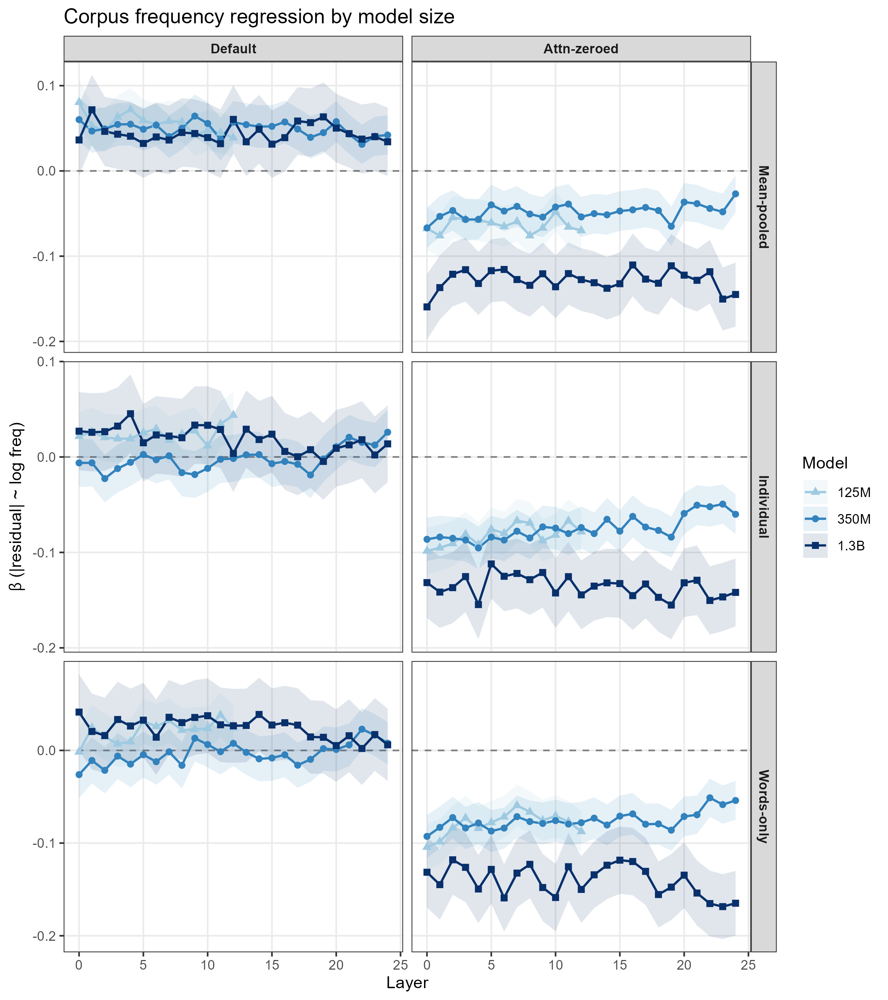

### Summary

| Condition | Mode | 125M vs 350M | 1.3B vs 350M |
|---|---|---|---|
| attn_zeroed | mean_pooled | ns (all layers) | *** more negative (all layers) |
| attn_zeroed | individual | ns (all layers) | * to *** more negative (most layers) |
| attn_zeroed | words_only | ns (all layers) | * to *** more negative (most layers) |
| default | mean_pooled | ns (all layers) | ns (all layers) |
| default | individual | ns (all layers) | ns (all layers) |
| default | words_only | ns (all layers) | ns (all layers) |

**Interpretation:** The negative frequency effect in the attn_zeroed condition grows significantly from 350M to 1.3B but not from 125M to 350M — the jump in individual-word representation quality is concentrated at the 1.3B scale. The positive frequency effect in the default condition is completely scale-invariant.

### Effective log-frequency slopes by model — attn_zeroed / mean_pooled

| Layer | β 125M | β 350M | β 1.3B | p (125 vs 350) | p (1.3B vs 350) |
|---:|---:|---:|---:|---|---|
| 0  | −0.068 | −0.067 | −0.159 | ns | <.001 *** |
| 1  | −0.076 | −0.053 | −0.137 | ns | <.001 *** |
| 2  | −0.055 | −0.046 | −0.121 | ns | <.001 *** |
| 3  | −0.057 | −0.057 | −0.116 | ns | .006 ** |
| 4  | −0.058 | −0.057 | −0.132 | ns | <.001 *** |
| 5  | −0.061 | −0.040 | −0.117 | ns | <.001 *** |
| 6  | −0.065 | −0.047 | −0.116 | ns | .001 ** |
| 7  | −0.059 | −0.042 | −0.127 | ns | <.001 *** |
| 8  | −0.076 | −0.051 | −0.134 | ns | <.001 *** |
| 9  | −0.067 | −0.054 | −0.121 | ns | .001 ** |
| 10 | −0.048 | −0.042 | −0.136 | ns | <.001 *** |
| 11 | −0.066 | −0.039 | −0.120 | ns | <.001 *** |
| 12 | −0.070 | −0.054 | −0.127 | ns | <.001 *** |
| 13 | — | −0.050 | −0.131 | — | <.001 *** |
| 14 | — | −0.052 | −0.138 | — | <.001 *** |
| 15 | — | −0.047 | −0.132 | — | <.001 *** |
| 16 | — | −0.046 | −0.110 | — | .004 ** |
| 17 | — | −0.043 | −0.127 | — | <.001 *** |
| 18 | — | −0.047 | −0.132 | — | <.001 *** |
| 19 | — | −0.065 | −0.111 | — | .037 * |
| 20 | — | −0.037 | −0.122 | — | <.001 *** |
| 21 | — | −0.038 | −0.128 | — | <.001 *** |
| 22 | — | −0.044 | −0.118 | — | .001 ** |
| 23 | — | −0.048 | −0.150 | — | <.001 *** |
| 24 | — | −0.027 | −0.145 | — | <.001 *** |

---

## 6. OPT-125M training dynamics

### Setup

Six log-spaced checkpoints (~0.6%–57.2% of total training): step24 (0.6%), step48 (1.2%), step144 (3.6%), step384 (9.6%), step912 (22.9%), step2280 (57.2%). Final-checkpoint results are reported in Section 1.

### Critical confound: model-derived preference labels

The preference label stored in the embedding NPZ files is `log P(alpha ordering) − log P(non-alpha ordering)`, computed from the model at each checkpoint (`extract_embeddings.py`, line 10). At early checkpoints the model has not yet learned ordering preferences, so all log-prob ratios cluster near 0. This near-zero label variance (SS_tot ≈ 0) artificially inflates r² regardless of what the embeddings encode: even a probe that predicts 0 for every item achieves high r² when the labels have negligible spread. The confound is most severe at step24–step144 and diminishes as training progresses and the model develops genuine ordering preferences. Cross-checkpoint comparisons of absolute r² are therefore not straightforward.

Step24 is excluded from all analyses below. Its CSV contains interleaved rows from two simultaneous write processes (the old per-condition parallel code), producing garbled concatenated lines and duplicate rows.

### Summary: peak r² across layers (default condition)

mp = mean_pooled, wo = words_only, pn = pair_novel, wn = word_novel. Peak-layer index shown in parentheses. † likely inflated by near-zero label variance.

| Checkpoint | % Training | mp / pn | mp / wn | wo / pn | wo / wn |
|---|---|---|---|---|---|
| step48  | 1.2%  | .912 (L0)† | .823 (L0)† | .492 (L0)† | .189 (L1) |
| step144 | 3.6%  | .831 (L0)† | .726 (L0)† | .525 (L0)† | .165 (L1) |
| step384 | 9.6%  | .642 (L0)† | .495 (L0)† | .460 (L0)  | .225 (L1) |
| step912 | 22.9% | .513 (L1)  | .363 (L1)  | .407 (L0)  | .236 (L1) |
| step2280| 57.2% | .348 (L8)  | .228 (L9)  | .335 (L12) | .212 (L8) |

### Layer profiles: default condition

#### mean_pooled / pair_novel

The layer profile inverts over training. Early checkpoints peak at layer 0 and fall monotonically toward later layers; by step2280, layer 0 is the lowest and layers 8–10 are the highest.

| Layer | step48† | step144† | step384† | step912 | step2280 |
|---:|---:|---:|---:|---:|---:|
| 0  | .912 | .831 | .642 | .477 | .244 |
| 1  | .705 | .695 | .610 | .513 | .304 |
| 2  | .673 | .693 | .606 | .500 | .309 |
| 3  | .656 | .673 | .605 | .491 | .300 |
| 4  | .639 | .671 | .607 | .485 | .312 |
| 5  | .636 | .666 | .601 | .486 | .326 |
| 6  | .626 | .638 | .608 | .506 | .342 |
| 7  | .620 | .647 | .606 | .505 | .344 |
| 8  | .613 | .651 | .615 | .495 | .348 |
| 9  | .574 | .643 | .610 | .511 | .346 |
| 10 | .604 | .629 | .600 | .489 | .346 |
| 11 | .574 | .617 | .604 | .499 | .337 |
| 12 | .579 | .620 | .610 | .505 | .342 |

#### words_only / pair_novel

Similar inversion but more gradual: early checkpoints are flat-to-decreasing, later checkpoints are flat-to-slightly-increasing.

| Layer | step48† | step144† | step384 | step912 | step2280 |
|---:|---:|---:|---:|---:|---:|
| 0  | .492 | .525 | .460 | .407 | .305 |
| 3  | .465 | .466 | .383 | .368 | .282 |
| 6  | .427 | .442 | .405 | .365 | .307 |
| 9  | .371 | .355 | .388 | .368 | .327 |
| 12 | .384 | .355 | .403 | .400 | .335 |

#### words_only / word_novel — least affected by the confound

This split (probe generalizes to both novel pairs AND novel words) is least sensitive to the label-variance confound: novel-word embeddings carry little word-identity information regardless of checkpoint, so there is no trivial 0-prediction shortcut. Values are stable across all checkpoints.

| Layer | step48 | step144 | step384 | step912 | step2280 |
|---:|---:|---:|---:|---:|---:|
| 0  | .173 | .155 | .202 | .207 | .157 |
| 3  | .181 | .157 | .220 | .226 | .175 |
| 6  | .165 | .142 | .203 | .228 | .195 |
| 9  | .155 | .126 | .204 | .229 | .210 |
| 12 | .158 | .129 | .213 | .231 | .208 |

### Trends

1. **The apparent r² decline over training is largely an artifact of changing label variance.** At step48, all model log-prob ratios are near 0 (the model has no preferences), inflating r². By step2280, the model has developed genuine ordering preferences and the label distribution has real spread; r² then reflects actual probe fidelity. Cross-checkpoint r² comparisons for mean_pooled are unreliable until at least step912.

2. **The layer profile inverts as training progresses.** At step48, layer 0 is the most informative for mean_pooled/pair_novel (r² = .912), declining monotonically toward higher layers. By step2280 the profile reverses: later layers (8–10) are most informative (r² ≈ .348), and layer 0 is weakest (.244). This matches the final-checkpoint peak at layer 9 (r² = .385; Section 1). The early layer-0 dominance likely reflects that initial embedding representations carry whatever sparse ordering signal exists, and that this signal hasn't yet been reorganized across attention layers. As training progresses, ordering-relevant information migrates to and is refined in deeper layers.

3. **words_only / word_novel is stable (~.15–.24 across all checkpoints and layers).** The absence of a trend confirms that the strictest generalization condition is unaffected by the label-variance confound, and also suggests that the capacity to generalize ordering knowledge to unseen words doesn't grow substantially over the training range sampled here. The upward trend across layers within later checkpoints (layer 0 < layer 9 at step2280) may be the first sign of a layer-ascending organizational structure that becomes clearer in the final model.

4. **Most ordering-relevant structure is established by ~57% of training.** Step2280 peak r² (mean_pooled/pair_novel: .348) is already close to the final model's (.385), suggesting the remaining training mainly refines rather than builds the representation.

5. **The attn_zeroed condition shows the same qualitative patterns** (profile inversion, convergence by step2280), with generally lower absolute r² for the word_novel split, consistent with cross-word attention carrying pair-level ordering information that isn't available when that attention is zeroed.
